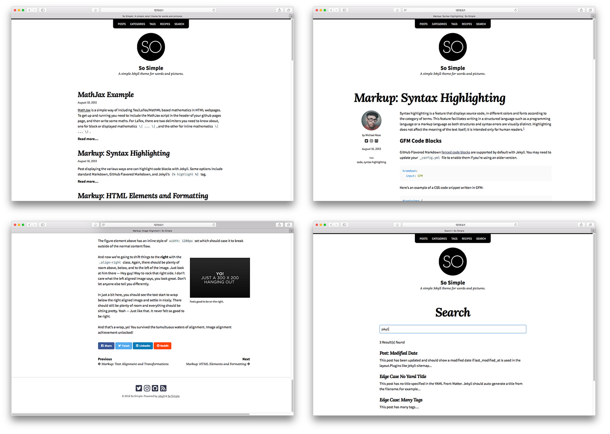

# [So Simple Jekyll Theme][1]

[](https://raw.githubusercontent.com/mmistakes/so-simple-theme/master/LICENSE)
[](https://jekyllrb.com/)
[](https://rubygems.org/gems/jekyll-theme-so-simple)
[](https://www.paypal.me/mmistakes)

So Simple is a simple [Jekyll theme](https://jekyllrb.com/docs/themes/) for your words and pictures. Built to provide:

* A variety of layouts with clean and readable typography.
* [Microformats](http://microformats.org/wiki/microformats2) markup to make post content machine-readable and discoverable.
* Disqus Comments and Google Analytics support.
* SEO best practices via [Jekyll SEO Tag][jekyll-seo-tag].
* Options to customize the theme and make it your own.

**If you enjoy this theme, please consider [supporting me](https://www.paypal.me/mmistakes) for developing and maintaining it.**

[](https://www.paypal.me/mmistakes)

:sparkles: **See what's new in the [CHANGELOG](CHANGELOG.md).**

:blue_book: **[v2 documentation](README-OLD.md)**.

[![So Simple live preview][2]][1]



[1]: https://mmistakes.github.io/so-simple-theme/
[2]: screenshot.png "site preview"

## Sample Pages

| Description |    |    |
| ----------- | -- | -- |
| A post with a large hero image. | [Preview][post-hero-preview] | [Source][post-hero-source] |
| A post with a variety of common HTML elements showing how the theme styles them. | [Preview][post-html-elements-preview] | [Source][post-html-elements-source] |
| Post displaying highlighted code. | [Preview][post-syntax-preview] | [Source][post-syntax-code] |
| A post displaying images with a variety of alignments. | [Preview][post-image-alignment-preview] | [Source][post-image-alignment-source] |
| All posts grouped by year. | [Preview][posts-year-preview] | [Source][posts-year-source] |
| All posts grouped by category. | [Preview][posts-category-preview] | [Source][posts-category-source] |
| All posts grouped by tag. | [Preview][posts-tag-preview] | [Source][posts-tag-source] |
| Category page. | [Preview][category-page-preview] | [Source][category-page-source] |
| Listing of documents in grid view. | [Preview][grid-view-preview] | [Source][grid-view-source] |

[post-hero-preview]: https://mmistakes.github.io/so-simple-theme/layout/layout-hero-image/
[post-hero-source]: docs/_posts/2012-03-14-layout-hero-image.md
[post-html-elements-preview]: https://mmistakes.github.io/so-simple-theme/markup/markup-html-elements-and-formatting/
[post-html-elements-source]: docs/_posts/2013-01-11-markup-html-elements-and-formatting.md
[post-syntax-preview]: https://mmistakes.github.io/so-simple-theme/markup-syntax-highlighting/
[post-syntax-code]: docs/_posts/2013-08-16-markup-syntax-highlighting.md
[post-image-alignment-preview]: https://mmistakes.github.io/so-simple-theme/markup/markup-image-alignment/
[post-image-alignment-source]: docs/_posts/2013-01-10-markup-image-alignment.md
[posts-year-preview]: https://mmistakes.github.io/so-simple-theme/posts/
[posts-year-source]: docs/posts.md
[posts-category-preview]: https://mmistakes.github.io/so-simple-theme/categories/
[posts-category-source]: docs/categories.md
[posts-tag-preview]: https://mmistakes.github.io/so-simple-theme/tags/
[posts-tag-source]: docs/tags.md
[category-page-preview]: https://mmistakes.github.io/so-simple-theme/categories/edge-case/
[category-page-source]: docs/edge-case.md
[grid-view-preview]: https://mmistakes.github.io/so-simple-theme/recipes/
[grid-view-source]: docs/recipes.md

Additional [sample posts](https://mmistakes.github.io/so-simple-theme/posts/) can be view on the demo site. Source files for these (and the entire demo site) can be found in [`/docs`](docs) folder.

## Table of Contents

1. [Installation](#installation)
    1. [Ruby Gem Method](#ruby-gem-method)
    2. [GitHub Pages Method](#github-pages-method)
        1. [Remove the Unnecessary](#remove-the-unnecessary)
2. [Upgrading](#upgrading)
    1. [Ruby Gem](#ruby-gem)
    2. [Remote Theme](#remote-theme)
    3. [Use Git](#use-git)
    4. [Update Files Manually](#update-files-manually)
3. [Structure](#structure)
    1. [Starting Fresh](#starting-fresh)
    2. [Starting from `jekyll new`](#starting-from-jekyll-new)
4. [Configuring](#configuring)
    1. [Site Skin](#site-skin)
    2. [Site Locale](#site-locale)
    3. [Site URL](#site-url)
    4. [Site Base URL](#site-base-url)
    5. [Date Format](#date-format)
    6. [Reading Time](#reading-time)
    7. [Mathematics](#mathematics)
    8. [Google Fonts](#google-fonts)
    9. [Pagination](#pagination)
    10. [Search](#search)
    11. [Taxonomy Pages](#taxonomy-pages)
    12. [Comments (via Disqus)](#comments-via-disqus)
    13. [Google Analytics](#google-analytics)
    14. [Other](#other)
5. [Layouts](#layouts)
    1. [`layout: default`](#layout-default)
    2. [`layout: post`](#layout-post)
    3. [`layout: page`](#layout-page)
    4. [`layout: home`](#layout-home)
    5. [`layout: posts`](#layout-posts)
    6. [`layout: categories`](#layout-categories)
    7. [`layout: tags`](#layout-tags)
    8. [`layout: collection`](#layout-collection)
    9. [`layout: category`](#layout-category)
    10. [`layout: tag`](#layout-tag)
    11. [`layout: search`](#layout-search)
6. [Images](#images)
7. [Theme Text](#theme-text)
8. [Navigation](#navigation)
9. [Author](#author)
10. [Footer](#footer)
    1. [Footer Links](#footer-links)
    2. [Copyright Text](#copyright-text)
11. [Helpers](#helpers)
    1. [Responsive Embed](#responsive-embed)
    2. [Table of Contents](#table-of-contents)
12. [Migration Guide](#migration-guide)
    1. [Global Changes](#global-changes)
    2. [Browser Support](#browser-support)
    3. [Configuration Changes](#configuration-changes)
        1. [Locale Changes](#locale-changes)
        2. [Owner Changes](#owner-changes)
        3. [Google Analytics Changes](#google-analytics-changes)
        4. [Disqus Comments Changes](#disqus-comments-changes)
    4. [Search Changes](#search-changes)
    5. [Image Changes](#image-changes)
    6. [Development Changes](#development-changes)
    7. [Step-by-Step](#step-by-step)
13. [Customization](#customization)
    1. [Overriding Includes and Layouts](#overriding-includes-and-layouts)
    2. [Customizing Sass (SCSS)](#customizing-sass-scss)
    3. [Customizing JavaScript](#customizing-javascript)
14. [Font Awesome Icons](#font-awesome-icons)
15. [Development](#development)
    1. [JavaScript Build Script](#javascript-build-script)
16. [Contributing](#contributing)
17. [Credits](#credits)
18. [License](#license)

## Installation

If you're running Jekyll v3.5+ and self-hosting you can quickly install the theme as a Ruby gem. If you're hosting with [**GitHub Pages**](https://pages.github.com/) you can install as a [remote theme](https://github.com/benbalter/jekyll-remote-theme) or directly copy all of the theme files (see [structure](#structure) below) into your project.

### Ruby Gem Method

1. Add this line to your Jekyll site's `Gemfile` (or [create one](example/Gemfile)):

   ```ruby
   gem "jekyll-theme-so-simple"
   ```

2. Add this line to your Jekyll site's `_config.yml` file:

   ```yaml
   theme: jekyll-theme-so-simple
   ```

3. Then run [Bundler](http://bundler.io/) to install the theme gem and dependencies:

   ```terminal
   bundle install
   ```

### GitHub Pages Method

GitHub Pages has added [full support](https://github.com/blog/2464-use-any-theme-with-github-pages) for any GitHub-hosted theme.

1. Replace `gem "jekyll"` with:

   ```ruby
   gem "github-pages", group: :jekyll_plugins
   ```

2. Run `bundle update` and verify that all gems install properly.

3. Add `remote_theme: "mmistakes/so-simple-theme@3.2.0"` to your
   `_config.yml` file. Remove any other `theme:` or `remote_theme:` entries.

---

**Note:** Your Jekyll site should be viewable immediately at <http://USERNAME.github.io>. If it's not, you can force a rebuild by pushing empty commits to GitHub (see below for more details).

If you're hosting several Jekyll based sites under the same GitHub username you will have to use Project Pages instead of User Pages. Essentially you rename the repo to something other than **USERNAME.github.io** and create a `gh-pages` branch off of `master`. For more details on how this works, check [GitHub's documentation](https://help.github.com/articles/user-organization-and-project-pages/).

#### Remove the Unnecessary

If you forked or downloaded the [`so-simple-theme` repo](https://github.com/mmistakes/so-simple-theme) you can safely remove the following files and folders:

* `.github`
* `docs`
* `example`
* `.editorconfig`
* `.gitattributes`
* `banner.js`
* `CHANGELOG.md`
* `Gemfile`
* `jekyll-theme-so-simple.gemspec`
* `package.json`
* `Rakefile`
* `README.md`
* `README-OLD.md`
* `screenshot.png`

## Upgrading

If you're using the Ruby Gem or remote theme versions of So Simple, upgrading is fairly painless.

To check which version you are currently using, view the source of your built site and you should something similar to:

```
<!--
    So Simple Jekyll Theme 3.0.0
    Copyright 2013-2018 Michael Rose - mademistakes.com | @mmistakes
    Free for personal and commercial use under the MIT license
    https://github.com/mmistakes/so-simple-theme/blob/master/LICENSE
-->
```

This will be at the top of every `.html` file, `/assets/css/main.css`, and `/assets/js/main.js`.

### Ruby Gem

Simply run `bundle update` if you're using Bundler (have a `Gemfile`) or `gem update jekyll-theme-so-simple` if you're not.

### Remote Theme

Verify you have the [latest version](https://github.com/mmistakes/so-simple-theme/releases) assigned in `_config.yml`

```
remote_theme: "mmistakes/so-simple-theme@3.2.0"
```

Note: If `@x.x.x` is omitted the theme's current `master` branch will be used. It is advised to ["lock" `remote_theme`](https://github.com/benbalter/jekyll-remote-theme#declaring-your-theme) at a specific version to avoid introducing breaking changes to your site.

The next step requires rebuilding your [GitHub Pages](https://pages.github.com/) site so it can pull down the latest theme updates. This can be achieved by pushing up a commit to your GitHub repo.

An empty commit will get the job done too if you don't have anything to push at the moment:

```terminal
git commit --allow-empty -m "Force rebuild of site"
```

### Use Git

If you want to get the most out of the Jekyll + GitHub Pages workflow, then you'll need to utilize Git. To pull down theme updates manually you must first ensure there's an upstream remote. If you forked the theme's repo then you're likely good to go.

To double check, run `git remote -v` and verify that you can fetch from `origin https://github.com/mmistakes/so-simple-theme.git`.

To add it you can do the following:

```terminal
git remote add upstream https://github.com/mmistakes/so-simple-theme.git
```

#### Pull Down Updates

Now you can pull any commits made to theme's `master` branch with:

```terminal
git pull upstream master
```

Depending on the amount of customizations you've made after forking, there's likely to be merge conflicts. Work through any conflicting files Git flags, staging the changes you wish to keep, and then commit them.

### Update Files Manually

Another way of dealing with updates is [downloading the theme](https://github.com/mmistakes/so-simple-theme/archive/master.zip) --- replacing your layouts, includes, and assets with the newer ones manually. To be sure that you don't miss any changes review the theme's [commit history](https://github.com/mmistakes/so-simple-theme/commits/master) to see what has changed.

Here's a quick checklist of the important folders/files you'll want to be mindful of:

| Name                   |                                                                                |
| ---------------------- | ------------------------------------------------------------------------------ |
| `_layouts`             | Replace all. Apply edits if you customized any layouts.                        |
| `_includes`            | Replace all. Apply edits if you customized any includes.                       |
| `assets`               | Replace all. Apply edits if you customized stylesheets or scripts.             |
| `_sass`                | Replace all. Apply edits if you customized Sass partials.                      |
| `_data/navigation.yml` | Safe to keep. Verify that there were no major structural changes or additions. |
| `_data/text.yml`       | Safe to keep. Verify that there were no major structural changes or additions. |
| `_config.yml`          | Safe to keep. Verify that there were no major structural changes or additions. |

---

**Note:** If you're not seeing the latest version, be sure to flush browser and CDN caches. Depending on your hosting environment older versions of `/assets/css/main.css`, `/assets/js/main.min.js`, or `*.html` files may be cached.

## Structure

Layouts, includes, Sass partials, and data files are all placed in their default locations. Stylesheets and scripts can be found in `assets`, and a few development related files in the project's root directory.

**Please note:** If you installed So Simple via the Ruby Gem or remote theme methods, theme files found in `/_layouts`, `/_includes`, `/_sass`, and `/assets` will be missing from your project. This is normal as they are bundled with the [`jekyll-theme-so-simple`](https://rubygems.org/gems/jekyll-theme-so-simple) gem.

```
├── _data               # data files
|  ├── navigation.yml   # navigation bar links
|  └── text.yml         # theme text
├── _includes           # theme includes
├── _layouts            # theme layouts (see below for usage)
├── _sass               # Sass partials
├── assets
|  ├── css
|  |  └── main.scss
|  └── js
|     └── main.min.js
├── _config.yml         # sample configuration
└── index.md            # sample home page (recent posts/not paginated)
```

### Starting Fresh

After creating a `Gemfile` and installing the theme you'll need to add and edit the following files:

* [`_config.yml`](_config.yml)
* [`/_data/navigation.yml`](_data/navigation.yml)
* [`/_data/text.yml`](_data/text.yml)
* [`index.md`](index.md)

**Note:** Consult the [**pagination**](#pagination) documentation below for instructions on how to enable it on the home page.

### Starting from `jekyll new`

Using the `jekyll new` command will get you up and running the quickest.

Edit your `Gemfile` and `_config.yml` files following the [installation guide](#installation) above and [configuration guide](#configuring) below, then create `_data/text.yml` as instructed earlier.

## Configuring

Configuration of site-wide elements (`locale`, `title`, `description`, `url`, `logo`, `author`, etc.) happens in your project's `_config.yml`. See the [example configuration](example/_config.yml) in this repo for additional reference.

| Name          | Description                                                              | Example                             |
| ------------- | ------------------------------------------------------------------------ | ----------------------------------- |
| `locale`      | Primary language for the site.                                           | `"en-us"`                           |
| `title`       | Site's title.                                                            | `"My Awesome Site"`                 |
| `description` | A short description.                                                     | `"This is my site, it is awesome."` |
| `baseurl`     | Used to test the website under the same base url it will be deployed to. | `/my-base-path`                     |
| `url`         | The full URL to your site.                                               | `"https://your-site.com"`           |
| `logo`        | Path to a site-wide logo used in masthead.                                | `/images/your-logo.png`             |

### Site Skin

Three skins (default, light, and dark) are available to change the color palette of the theme.

| `default.css` | `light.css` | `dark.css` |
| --- | --- | --- |
|  |  |  |

```yaml
skin: "/assets/css/skins/default.css"
skin: "/assets/css/skins/light.css"
skin: "/assets/css/skins/dark.css"
```

To use a custom skin other than the ones provided:

1. Copy and rename [`/assets/css/skins/default.css`](https://github.com/mmistakes/so-simple-theme/blob/master/assets/css/skins/default.css) to your local repo.
2. Override and customize Sass variables as you see fit.
3. Update the `skin` path in `_config.yml` to reference this new skin `.css` file.

### Site Locale

**`site.locale`** is used to declare the primary language for each web page within the site.

_Example:_ locale: `"en-US"` sets the lang attribute for the site to the United States flavor of English, while `en-GB` would be for the United Kingdom style of English. Country codes are optional and the shorter variation `locale: "en"` is also acceptable. To find your language and country codes check this [reference table](<https://msdn.microsoft.com/en-us/library/ee825488(v=cs.20).aspx>).

Properly setting the locale is important for associating localized text found in the text data file.

**Note:** The theme defaults to text in English (`en`, `en-US`, `en-GB`). If you change locale in `_config.yml` to something else be sure to add the corresponding locale key and translated text to [`_data/text.yml`](_data/text.yml).

### Site URL

The base hostname and protocol for your site. If you're hosting with GitHub Pages this will be something like `url: "https://github.io.mmistakes"` or `url: "https://your-site.com"` if you have a custom domain name.

GitHub Pages now [forces `https://` for new sites](https://help.github.com/articles/securing-your-github-pages-site-with-https/), so be mindful of that when setting your URL to avoid mixed-content warnings.

**Note:** Jekyll overrides the value of `url` with `http://localhost:4000` when running `jekyll serve` locally in development. If you want to avoid this behavior set `JEKYLL_ENV=production` to [force the environment](http://jekyllrb.com/docs/configuration/#specifying-a-jekyll-environment-at-build-time) to production.

### Site Base URL

This option causes all kinds of confusion in the Jekyll community. If you're not hosting your site as a [GitHub Project Page](https://help.github.com/articles/user-organization-and-project-pages/) or in a subfolder (e.g., `/blog`), then don't mess with it.

In the case of the **So Simple** demo site it's hosted on GitHub at <https://mmistakes.github.io/so-simple-theme>. To correctly set this base path I'd use `url: "https://mmistakes.github.io"` and `baseurl: "/so-simple-theme"`.

For more information on how to properly use `site.url` and `site.baseurl` as intended by the Jekyll maintainers, check [Parker Moore's post on the subject](https://byparker.com/blog/2014/clearing-up-confusion-around-baseurl/).

**Note:** When using `baseurl` remember to include it as part of your link and asset paths in your content. Values of `url:` and `baseurl: "/blog"` would make your local site visible at <http://localhost:4000/blog> and not <http://localhost:4000>. You can either prepend all your asset and internal link paths with `{{ site.baseurl }}` or use Jekyll's `relative_url`.

To use the example values above the following image path of `{{ '/images/my-image.jpg' | relative_url }}` would output correctly as `http://localhost:4000/blog/images/my-image.jpg`.

Without the `relative_url` filter that asset path would be missing `/blog` and you'd have a broken image on your page.

### Date Format

You can change the default date format by specifying `date_format` in `_config.yml`. It accepts any of the standard [Liquid date formats](http://shopify.github.io/liquid/filters/date/).

For example the default value of `"%B %-d, %Y"` could be changed like so:

```yaml
date_format: "%Y-%m-%d"
```

### Reading Time

Enable estimated reading time snippets site-wide with `read_time: true`. **`200`** has been set as the default words per minute value — which can be changed via `words_per_minute` in your `_config.yml` file.

```yaml
read_time: true
words_per_minute: 200
```

### Mathematics

Enable [**MathJax**](https://www.mathjax.org) (a JavaScript display engine for mathematics) site-wide with `mathjax: true`.

### Google Fonts

Easily use [**Google Fonts**](https://fonts.google.com/) throughout your site by replacing the font `name` and `weights` accordingly. Suggested font pairings are as follows:

```yaml
google_fonts:
  - name: "Source Sans Pro"
    weights: "400,400i,700,700i"
  - name: "Lora"
    weights: "400,400i,700,700i"
```

**Note:** If other font families are used, be sure to add, then override the following SCSS variables in `/assets/css/main.scss` with the `font-family` values Google provides.

```scss
$serif-font-family: "Lora", serif;
$sans-serif-font-family: "Source Sans Pro", sans-serif;
$monospace-font-family: Menlo, Consolas, Monaco, "Courier New", Courier,
  monospace;

$base-font-family: $sans-serif-font-family;
$headline-font-family: $sans-serif-font-family;
$title-font-family: $serif-font-family;
$description-font-family: $serif-font-family;
$meta-font-family: $serif-font-family;
```

See [stylesheet documentation](#customizing-sass-scss) below for more information on overriding the theme's default variables.

### Pagination

Break up the main listing of posts on the home page across multiple pages by [enabling pagination](http://jekyllrb.com/docs/pagination/).

1. Include the [`jekyll-paginate`][jekyll-paginate] plugin in your `Gemfile`.

   ```ruby
   group :jekyll_plugins do
     gem "jekyll-paginate"
   end
   ```

2. Add `jekyll-paginate` to the `plugins` array (previously `gems`) in your `_config.yml` file and the following pagination settings:

   ```yaml
   paginate: 10  # amount of posts to show per page
   paginate_path: /page:num/
   ```

3. Create `index.html` (or rename `index.md`) in the root of your project and add the following front matter:

   ```yaml
   layout: home
   paginate: true
   ```

### Search

To index the full content of your documents for use in a [search page](#layout-search), set `search_full_content` to `true` in `_config.yml`:

```yaml
search_full_content: true
```

**Note:** Large amounts of posts will increase the size of the search index, impacting page load performance. Setting `search_full_content` to `false` (the default) restricts indexing to the first 50 words of body content.

### Taxonomy Pages

By default, category and tags added to a post are not linked to taxonomy archive pages. To enable this behavior and link to pages with posts grouped by category or tag, add the following:

```yaml
category_archive_path: "/categories/#"
tag_archive_path: "/tags/#"
```

These paths should mimic the permalinks used for your [**categories**](#layout-categories) and [**tags archive**](#layout-tags) pages. The `#` at the end is necessary to target the correct taxonomy section on the pages.

For example if you were to create `categories.md` with the following front matter:

```yaml
title: Categories Archive
layout: categories
permalink: /foo/
```

You'd need to change `category_archive_path` to `"/foo/#` for category links to function properly.

**Note:** You can create dedicated category and tag pages manually with [`layout: category`](#layout-category) and [`layout: tag`](#layout-tag). Or use plugins like [**jekyll-archives**][jekyll-archives] or [**jekyll-paginate-v2**](https://github.com/sverrirs/jekyll-paginate-v2/blob/master/README-AUTOPAGES.md) to generate them automatically.

### Comments (via Disqus)

If you have a [**Disqus**](https://disqus.com/) account, you can show a comments section below each post.

To enable Disqus comments, add your [Disqus shortname](https://help.disqus.com/customer/portal/articles/466208) to your project's `_config.yml` file:

```yaml
disqus:
  shortname: my_disqus_shortname
```

Comments only appear in production when built with the following [environment value](http://jekyllrb.com/docs/configuration/#specifying-a-jekyll-environment-at-build-time): `JEKYLL_ENV=production` to avoid polluting your Disqus account with `localhost` content.

If you don't want to display comments for a particular post you can disable them by adding `comments: false` to that post's front matter.

### Google Analytics

To enable [**Google Analytics**](https://analytics.google.com/analytics/web/), add your tracking ID to `_config.yml` like so:

```yaml
google_analytics: UA-NNNNNNNN-N
```

Similar to Disqus comments above, the Google Analytics tracking script will only appear in production when using the following environment value: `JEKYLL_ENV=production`.

### Other

For more configuration options be sure to consult the documentation for:
[**jekyll-seo-tag**][jekyll-seo-tag], [**jekyll-feed**][jekyll-feed],
[**jekyll-paginate**][jekyll-paginate], and [**jekyll-sitemap**][jekyll-sitemap].

---

## Layouts

This theme provides the following layouts, which you can use by setting the `layout` [front matter](https://jekyllrb.com/docs/frontmatter/) on each page, like so:

```yaml
---
layout: name
---
```

### `layout: default`

This layout handles all of the basic page scaffolding placing the page content between the masthead and footer elements. All other layouts inherit this one and provide additional styling and features inside of the `{{ content }}` block.

### `layout: post`

This layout accommodates the following front matter:

| Name | Type | Description |
| ---- | ----- | ---------- |
| `image` | String | Path to a large image associated with the post. Also used for [OpenGraph](http://ogp.me/), [Twitter Cards](https://dev.twitter.com/cards), and site feed thumbnail if enabled. [Suggested image sizes](#images). |
| `image.path` | String | Same as above. Used when a `thumbnail` or `caption` needs to be assigned to the `image` object as well. |
| `image.caption` | String | Describes the image or provides credit. Markdown is allowed. |
| `author` | Object or string | Specify a post's author `name`, `picture`, `twitter`, `links`, etc. |
| `comments` | Boolean | Disable comments with `comments: false`. |
| `share` | Boolean | Add social share links to a post with `share: true`. |

**Post image example:**

```yaml
image:
  path: /images/post-image-lg.jpg
  thumbnail: /images/post-image-th.jpg
  caption: "Photo credit [Unsplash](https://unsplash.com/)"
```

**Note:** `image.feature` front matter has been deprecated, to fully support [jekyll-seo-tag][jekyll-seo-tag]. If you are not using `thumbnail` or `caption` the post image can be assigned more concisely as `image: /images/your-post-image.jpg`.

**Post author example:**

```yaml
# post specific author data if different from what is set in _config.yml
author:
  name: John Doe
  picture: /images/john-doe.jpg
  twitter: johndoe
```

**Note:** Author information can centralized in `_data/authors.yml` by doing following in the document's front matter:

```yaml
author: johndoe
```

With the corresponding author key in `_data/authors.yml`:

```yaml
johndoe:
  name: John Doe
  picture: /images/john-doe.jpg
  twitter: johndoe
```

**Note:** `author.picture` recommended size is `150 x 150` pixels.

#### Author Links

To define what links appear in the author sidebar use the `authors.links` key in either `_config.yml` or `/_data/authors.yml`.

| Name    | Description                                                                                                      |
| ------- | ---------------------------------------------------------------------------------------------------------------- |
| `title` | Describes the link. Not visible, used for accessibility purposes.                                                |
| `url`   | URL the link points to.                                                                                          |
| `icon`  | Corresponds with a [Font Awesome icon](https://fontawesome.com/icons?d=gallery) e.g., `fab fa-twitter-square`.   |

**Example:**

```yaml
author:
  links:
    - title: Twitter
      url: https://twitter.com/username
      icon: fab fa-twitter-square
    - title: Instagram
      url: https://instagram.com/username
      icon: fab fa-instagram
    - title: GitHub
      url: https://github.com/username
      icon: fab fa-github-square
```

**Note:** To disable author links completely use use:

```yaml
author:
  links: false
```

### `layout: page`

Visually this layout looks and acts similar `layout: post`, with the following
differences.

* Author sidebar and page meta (published date, categories, and tags) are ommitted.
* Page is less wide due to omitted sidebar.
* Disqus comments are omitted.
* Next/Previous post navigation links omitted.

The page layout forms the base for several other layouts like [`home`](#layout-home), [`posts`](#layout-posts), [`categories`](#layout-categories), [`tags`](#layout-tags), [`collection`](#layout-collection), [`category`](#layout-category), [`tag`](#layout-tag), and [`search`](#layout-search).

### `layout: home`

This layout accommodates the same front matter as `layout: page`, with the
addition of the following:

```yaml
paginate: true  # enables pagination loop, see section above for additional setup
entries_layout: # list (default), grid
```

When pagination is not enabled the page defaults to showing the latest 10 posts. To change the amount of posts shown, assign a limit value by adding the following to the page's front matter.

```yaml
posts_limit: 5
```

By default, posts are shown in a list view. To change to a grid view add `entries_layout: grid` to the page's front matter.

### `layout: posts`

This layout displays all posts grouped by the year they were published. It accommodates the same front matter as `layout: page`.

By default, posts are shown in a list view. To change to a grid view add `entries_layout: grid` to the page's front matter.

### `layout: categories`

This layout displays all posts grouped category. It accommodates the same front matter as `layout: page`.

By default, posts are shown in a list view. To change to a grid view add `entries_layout: grid` to the page's front matter.

### `layout: tags`

This layout displays all posts grouped by tag. It accommodates the same front matter as `layout: page`.

By default, posts are shown in a list view. To change to a grid view add `entries_layout: grid` to the page's front matter.

### `layout: collection`

This layout displays all documents grouped by a specific collection. It accommodates the same front matter as `layout: page` with the addition of the following:

```yaml
collection: # collection name
entries_layout: # list (default), grid
show_excerpts: # true (default), false
sort_by: # date (default) title
sort_order: # forward (default), reverse
```

To create a page showing all documents in the `recipes` collection you'd create `recipes.md` in the root of your project and add this front matter:

```yaml
title: Recipes
layout: collection
permalink: /recipes/
collection: recipes
```

By default, documents are shown in a list view. To change to a grid view add `entries_layout: grid` to the page's front matter. If you want to sort the collection by title add `sort_by: title`. If you want reverse sorting, add `sort_order: reverse`. If you are simply looking for a list that shows recipe titles (no excerpts), add `show_excerpts: false`.

### `layout: category`

This layout displays all posts grouped by a specific category. It accommodates the same front matter as `layout: page` with the addition of the following:

```yaml
taxonomy: # category name
entries_layout: # list (default), grid
```

By default, posts are shown in a list view. To change to a grid view add `entries_layout: grid` to the page's front matter.

To create a page showing all posts assigned to the category `foo` you'd create `foo.md` in the root of your project and add this front matter:

```yaml
title: Foo
layout: category
permalink: /categories/foo/
taxonomy: foo
```

### `layout: tag`

This layout displays all posts grouped by a specific tag. It accommodates the same front matter as `layout: page` with the addition of the following:

```yaml
taxonomy: # tag name
entries_layout: # list (default), grid
```

By default, posts are shown in a list view. To change to a grid view add `entries_layout: grid` to the page's front matter.

To create a page showing all posts assigned to the tag `foo bar` you'd create `foo-bar.md` in the root of your project and add this front matter:

```yaml
title: Foo Bar
layout: tag
permalink: /tags/foo-bar/
taxonomy: foo bar
```

### `layout: search`

This layout displays a search form and displays related pages based on the query.

Page content index: `title`, `excerpt`, `content` (when enabled), `categories`, `tags`, and `url`.

If you would like to exclude specific pages/posts from the search index set the search flag to `false` in their front matter.

```yaml
search: false
```

To index the full content of your documents set `search_full_content` to `true` in `_config.yml`:

```yaml
search_full_content: true
```

**Note:** Large amounts of posts will increase the size of the search index, impacting page load performance. Setting `search_full_content` to `false` (the default) restricts indexing to the first 50 words of body content.

## Images

Suggested image sizes in pixels are as follows:

| Image | Description | Size |
| ----- | ----------- | ---- |
| `site.logo` | Site-wide logo used in masthead. | `200 x 200` |
| `page.image.path` | Large full-width document image. | Tall images will push content down the page. `1600 x 600` is a good middle-ground size to aim for. |
| `page.image` | Short-hand for `page.image.path` when used alone (without `thumbnail`, `caption`, or other variables). | Same as `page.image.path` |
| `page.image.thumbnail` | Small document image used in grid view. | `400 x 200` |
| `author.picture` | Author picture in post sidebar. | `150 x 150` |

## Theme Text

To change text found throughout the theme, copy the following
[`/_data/text.yml`](_data/text.yml) file and customize as necessary.

When adding new texts be sure the keys match these [language/country codes](<https://msdn.microsoft.com/en-us/library/ee825488(v=cs.20).aspx>), that may be used for [`site.locale`](#site-locale).

## Navigation

To define what pages are linked in the top navigation:

1. Create a [`/_data/navigation.yml`](_data/navigation.yml) file.

2. Add pages in the order you'd like them to appear:

   ```yaml
   - title: Posts
     url: /posts/
   - title: Categories
     url: /categories/
   - title: External Page
     url: https://whatever-site.com/page.html
   - title: Search
     url: /search/
   ```

**Note:** Long titles or many links may cause the navigation bar to break into multiple lines, especially on smaller screens. Keep this in mind as you develop your site's primary navigation.

## Author

Author information is used as meta data for post "by lines" and propagates the `creator` field of Twitter summary cards with the following front matter in `_config.yml`:

```yaml
author:
  name: John Doe
  twitter: johndoetwitter
  picture: /images/johndoe.png
```

Site-wide author information can be overridden in a document's front matter in the same way:

```yaml
author:
  name: Jane Doe
  twitter: janedoetwitter
  picture: /images/janedoe.png
```

Or by specifying a corresponding key in the document's front matter, that exists in `site.data.authors`. E.g., you have the following in the document's front matter:

```yaml
author: megaman
```

And you have the following in `_data/authors.yml`:

```yaml
megaman:
  name: Mega Man
  twitter: megamantwitter
  picture: /images/megaman.png

drlight:
  name: Dr. Light
  twitter: drlighttwitter
  picture: /images/drlight.png
```

Currently `author.picture` is only used in `layout: post`. Recommended size is `150 x 150` pixels.

## Footer

The footer links and copyright text can both be customized.

### Footer Links

Footer links are set in `_config.yml` under the `footer_links` key.

| Name    | Description                                                                                                      |
| ------- | ---------------------------------------------------------------------------------------------------------------- |
| `title` | Describes the link. Not visible, used for accessibility purposes.                                                |
| `url`   | URL the link points to.                                                                                          |
| `icon`  | Corresponds with a [Font Awesome 5 icon](https://fontawesome.com/icons?d=gallery) e.g., `fab fa-twitter-square`. |

**Examples:**

```yaml
footer_links:
  - title: Twitter
    url: https://twitter.com/username
    icon: fab fa-twitter-square
  - title: GitHub
    url: https://github.com/mmistakes
    icon: fab fa-github-square
  - title: Feed
    url: atom.xml
    icon: fas fa-rss-square
```

**Note:** To disable footer links completely use `footer_links: false`.

### Copyright Text

By default the copyright inserts the current year, [`site.title`](#site-title), and the words `"Powered by Jekyll & So Simple."` To change this add `copyright` to your `_config.yml` like so (Markdown is allowed):

```yaml
copyright: "This site is made with <3 by *me, myself, and I*."
```

## Helpers

You can think of these Jekyll helpers as shortcodes. Since GitHub Pages doesn't allow most plugins --- [custom tags](https://jekyllrb.com/docs/plugins/#tags) are out. Instead the theme leverages [**includes**](https://jekyllrb.com/docs/templates/#includes) to do something similar.

### Responsive Embed

Embed a video from YouTube/Vimeo or any other `iframe` content that responsively sizes to fit the width of its parent.

| Parameter | Required | Description |
| --------- | -------- | ----------- |
| `url`     | Yes      | Video or iframe's URL e.g., `https://www.youtube.com/watch?v=-PVofD2A9t8` |
| `ratio`   | Optional | Ratio of the video or iframe content. `21:9`, `16:9`, `4:3`, `1:1`. If a ratio is not assigned `16:9` is used. |

**Example:**

```html

```

### Table of Contents

To include an [auto-generated table of contents](https://kramdown.gettalong.org/converter/html.html#toc) for posts and pages, add the following helper where you'd like it to appear.

```html

```

## Migration Guide

So Simple 3 is a major rewrite of the entire theme. The most notable changes are summarized below, followed by more specific changes.

It is safe to say you'll probably want to ditch all `_layouts`, `_includes`, `_sass`, `.css`, and `.js` files from v2 and use either the [Ruby gem](#ruby-gem-method) or [remote theme](github-pages-method) installation options.

### Global Changes

* "Fork method" has been deprecated in favor of installing/upgrading the theme via a gem or remote theme.
* All `_layouts`, `_includes`, `_sass`, and JavaScript have been rebuilt.
* Properly uses `site.url` and `site.baseurl` leveraging the `relative_url` and `absolute_url` filters.
* Replaced custom `/_includes/open-graph.html` with [**jekyll-seo-tag**][jekyll-seo-tag].
* Full control over links and icons used in author sidebar and footer.
* Tag, articles, and blog starter pages have been replaced with new layouts ([`tags`](#layout-tags) and [`posts`](#layout-posts)) for easier use.
* Removed `404.md` page.
* Replaced custom `atom.xml` feed file with [**jekyll-feed**][jekyll-feed].
* Removed default `favicon.ico` and `favicon.png` files.
* Replaced simple JSON search with [**Lunr**](https://lunrjs.com/).
* Replaced [Magnific Popup](http://dimsemenov.com/plugins/magnific-popup/) with [**Lity**](https://sorgalla.com/lity/).
* Removed [FitVids.JS](http://fitvidsjs.com/).

### Browser Support

* CSS written with modern browsers in mind. Where possible fallbacks for `float` based layouts have been used so things don't look *too broken* in browsers that don't support `display: grid` and flexbox.

### Configuration Changes

#### Locale Changes

Format has changed from `en_US` (with an underscore) to `en-US` with a hyphen.

#### Owner Changes

`site.owner` is now `site.author` to better support [jekyll-seo-tag][jekyll-seo-tag] and [jekyll-feed][jekyll-feed].

| v2                            | v3                                                             |
|-------------------------------|----------------------------------------------------------------|
| `site.owner.name`             | **`site.author.name`**                                         |
| `site.owner.avatar`           | **`site.author.picture`**                                      |
| `site.owner.email`            | **`site.author.email`**                                        |
| `site.owner.twitter`          | **`site.twitter`**                                             |
| `site.owner.google.analytics` | **deprecated**, replaced with [jekyll-seo-tag][jekyll-seo-tag] |
| `site.owner.bing-verify`      | **deprecated**, replaced with [jekyll-seo-tag][jekyll-seo-tag] |

#### Google Analytics Changes

`site.owner.google.analytics` is now `site.google_analytics`. [See documentation](#google-analytics) for more information.

#### Disqus Comments Changes

`site.owner.disqus-shortname` is now `site.disqus.shortname`. [See documentation](#comments-via-disqus) more information.

To disable comments on a particular post add `comments: false` to its front matter.

### Search Changes

`search_omit` has been renamed to `search`. To exclude a post or page from search add `search: false` to its front matter instead.

### Image Changes

When assigning image paths for things like the `site.logo`, `page.image.path`, `author.picture`, etc. they now require a full relative or absolute path.

In So Simple v2 images were all placed in `/images/` and assigned in front matter with just the filename. For images to properly load, you now need to prepend all paths with `/images/`... if you are storing images there e.g., `/images/your-image.jpg`.

To better support Jekyll plugin's like [jekyll-seo-tag][jekyll-seo-tag], [jekyll-feed][jekyll-feed], and [jekyll-sitemap][jekyll-sitemap] most of the `image` keys have been renamed. Adjust the front matter in all of your posts' and pages' accordingly.

| v2                 | v3                                         |
|--------------------|--------------------------------------------|
| `image.feature`    | **`image.path`**                           |
| `image.thumb`      | **`image.thumbnail`**                      |
| `image.credit`     | **`image.caption`** (Markdown allowed)     |
| `image.creditlink` | deprecated use `**image.caption**` instead |

A post with the following v2 front matter:

```yaml
image:
  feature: feature-image-filename.jpg
  thumb: thumb-image-filename.jpg
  credit: Michael Rose
  creditlink: https://mademistakes.com
```

Would be converted into the following v3 front matter:

```yaml
image:
  path: /images/feature-image-filename.jpg
  thumbnail: /images/thumb-image-filename.jpg
  caption: "[Michael Rose](https://mademistakes)"
```

### Development Changes

* Replaced Grunt tasks with [npm scripts](https://css-tricks.com/why-npm-scripts/).

### Step-by-Step

Rough steps to migrate a stock So Simple v2 fork (with no alterations) to the latest.

1. Remove `_includes/`, `_layouts/`, `_sass/`, `jshintrc`, `Gruntfile.js`, and `search.json`.
2. Edit `Gemfile` for either the [Ruby gem](#ruby-gem-method) or [GitHub Pages](#github-pages-method) installation methods and follow those instructions.
3. Add the following Google Fonts to `_config.yml`:

   ```yaml
   google_fonts:
     - name: "Source Sans Pro"
       weights: "400,400i,700,700i"
     - name: "Lora"
       weights: "400,400i,700,700i"
   ```

4. Edit `_config.yml` paying close attention to those keys that [have been renamed](#configuration-changes) or have new relative path requirements. `locale`, `logo`, and `owner` are good places to start.
5. Rename all instances of `image.feature`, `image.thumb`, and `image.credit` in posts/pages adhering to the [image changes](#image-changes) above.
6. Remove the body content in `index.html` and change `layout: page` to `layout: home`. Configure [pagination](#pagination) if necessary.
7. Remove the body content in `/search/index.md` and change `layout: page` to **`layout: search`**.
8. Remove the body content in `/tags/index.md` and change `layout: page` to **`layout: tags`**.
9. Remove the body content in `/articles/index.md` and change `layout: page` to **`layout: category`** and add **`taxonomy: articles`**.
10. Remove the body content in `/body/index.md` and change `layout: page` to **`layout: category`** and add **`taxonomy: blog`**.
11. Rename `modified` front matter in posts/pages to **`last_modified_at`** for improved parity with plugins that support it.
12. Add `tag_archive_path: "/tags/#"` to `_config.yml` to activate tag links in post meta sidebar.
13. Rename `avatar` to **`picture`** in `_data/authors.yml` (and in any posts/pages front matter), and edit the paths adhering to the [image path changes](#image-changes) above.

---

## Customization

When installing as a **Ruby gem** or **remote theme** the core theme files (`_layouts`, `_includes`, `_sass`, `assets`, etc.) will be absent from your project.

The default structure, style, and scripts of this theme can be overridden and customized in the following two ways:

### Overriding Includes and Layouts

Theme files can be [overridden](http://jekyllrb.com/docs/themes/#overriding-theme-defaults) by placing a file with the same name into your project's `_includes` or `_layouts` directory. For instance:

* To add another social sharing button to [`_includes/social-share.html`](_includes/social-share.html), create an `_includes` directory in your project, copy `_includes/social-share.html` from So Simple's gem folder to `<your_project>/_includes` and edit that file.

**ProTip:** to locate the theme's files on your computer run `bundle show jekyll-theme-so-simple`. This returns the location of the gem-based theme files.

The theme comes with two files to help inject custom markup and content into predefined locations.

|     | Description |
| --- | ----------- |
| [`_includes/head-custom.html`](_includes/head-custom.html) | Inserted inside the `<head>` element for adding metadata, favicons, etc. |
| [`_includes/footer-custom.html`](_includes/footer-custom.html) | Inserted inside the `<footer>` element before site scripts and copyright information. |

### Customizing Sass (SCSS)

To override the default [Sass](http://sass-lang.com/guide) (located in theme's
`_sass` directory), do one of the following:

1. Copy directly from the So Simple gem

   * Go to your local So Simple gem installation directory (run
     `bundle show jekyll-theme-so-simple` to get the path to it).
   * Copy the contents of `/assets/css/main.scss` from there to
     `<your_project>`.
   * Customize what you want inside `<your_project>/assets/css/main.scss`.

2. Copy from this repo.

   * Copy the contents of [assets/css/main.scss](assets/css/main.scss) to `<your_project>`.
   * Customize what you want inside `<your_project/assets/css/main.scss`.

**Note:** To customize the actual Sass partials bundled
in the gem, you will need to copy the complete contents of the `_sass` directory to `<your_project>`. Due to the way Jekyll currently imports these files it's all or nothing. Overriding a single Sass partial (or two) won't work like `_includes` and `_layouts`.

To make basic tweaks to theme's style, Sass variables can be overridden by adding to `<your_project>/assets/css/main.scss`. For instance, to change the accent color used throughout the theme add the following before all `@import` lines:

```scss
$accent-color: tomato;
```

### Customizing JavaScript

To override the default JavaScript bundled in the theme, do one of the following:

1. Copy directly from the So Simple gem

   * Go to your local So Simple gem installation directory (run
     `bundle show jekyll-theme-so-simple` to get the path to it).
   * Copy the contents of `/assets/js/main.js` from there to
     `<your_project>`.
   * Customize what you want inside `<your_project>/assets/js/main.js`.

2. Copy from this repo.

   * Copy the contents of [`/assets/js/main.js`](assets/js/main.js)
     to `<your_project>`.
   * Customize what you want inside `<your_project>/assets/js/main.js`.

The theme's [`/assets/js/main.min.js`](assets/js/main.min.js) file is built from jQuery plugins and other scripts found in [`/assets/js/`](assets/js).

```
├── assets
|  ├── js
|  |  ├── lunr                             # Lunr search plugin
|  |  |   ├── lunr.xx.js                   # Lunr language plugins
|  |  |   ├── ...
|  |  |   ├── lunr.min.js
|  |  |   └── lunr.stemmer.support.min.js
|  |  ├── plugins
|  |  |   ├── jquery.smooth-scroll.min.js  # make same-page links scroll smoothly
|  |  |   ├── lity.min.js                  # responsive lightbox
|  |  |   └── table-of-contents.js         # table of contents toggle
|  |  ├── main.js                          # jQuery plugin settings and other scripts
|  |  ├── main.min.js                      # concatenated and minified scripts
|  |  ├── search-data.json                 # search index used by Lunr
```

To modify or add your own scripts, include them in `assets/js/main.js` and then rebuild using `npm run build:js`. [See below for more details](#javascript-build-script).

If you add additional scripts to `/assets/js/plugins/` and would like them concatenated with the others, be sure to update the `uglify` script in [`package.json`](package.json). Same goes for scripts that you remove.

You can also add scripts to the `<head>` or closing `</body>` elements by adding paths to the following arrays in `_config.yml`.

**Example:**

```yaml
head_scripts:
  - https://code.jquery.com/jquery-3.2.1.min.js
  - /assets/js/your-custom-head-script.js
footer_scripts:
  - /assets/js/your-custom-footer-script.js
```

**Note:** If you assign paths to `footer_scripts` the theme's `/assets/js/main.min.js` file will be deactivated. This script includes plugins and other scripts that will cease to function unless you specifically add them to the `footer_scripts` array.

## Font Awesome Icons

The theme utilizes the [**Font Awesome** SVG with JS](https://fontawesome.com/) version for iconography. Prominent locations these icons appear are in the author sidebar and footer links.

---

## Development

To set up your environment to develop this theme:

1. Clone this repo
2. `cd` into `/example` and run `bundle install`.

To test the theme locally as you make changes to it:

1. `cd` into the root folder of the repo (e.g. `jekyll-theme-so-simple`).
2. Run `bundle exec rake preview` and open your browser to
   `http://localhost:4000/example/`.

This starts a Jekyll server using the theme's files and contents of the `example/` directory. As modifications are made, refresh your browser to see any changes.

### JavaScript Build Script

In an effort to reduce dependencies a set of [npm scripts](https://css-tricks.com/why-npm-scripts/) are used to build `main.min.js` instead of task runners like [Gulp](http://gulpjs.com/) or [Grunt](http://gruntjs.com/). If those tools are more your style then by all means use them instead :wink:.

To get started:

1. Install Node.js.
2. `cd` to the root of your project.
3. Install all of the dependencies by running npm install.

**Note:** If you upgraded from a previous version of the theme be sure you copied over [`package.json`](package.json) prior to running `npm install`. You may also need to remove your `node_modules` directory as well.

If all goes well, executing `npm run build:js` will compress/concatenate `main.js` and all plugin scripts into `/assets/js/main.min.js`.

## Contributing

Found a typo in the documentation? Requesting a feature or
[bug fix][issues]? Search through the open and closed issues before [submitting an issue][new-issue] to avoid duplication. 

[Pull requests][using-pull-requests] are also appreciated. If this is your first time, it may be helpful to read up on the [GitHub Flow][github-flow].

If your contribution adds or changes the theme's behavior, make sure to update the documentation and/or sample content. Documentation lives in README.md while sample posts, pages, and collections are in the [`docs`](docs) and [`example`](example) folders.

[issues]: https://github.com/mmistakes/so-simple-theme/issues
[new-issue]: https://github.com/mmistakes/so-simple-theme/issues/new
[using-pull-requests]: https://help.github.com/articles/using-pull-requests/
[github-flow]: https://guides.github.com/introduction/flow/

### Pull Requests

When submitting a pull request:

1. Clone the repo.
2. Create a branch off of `master` and give it a meaningful name (e.g.
   `my-awesome-new-feature`).
3. Open a pull request on GitHub and describe what problem it solves.

---

## Credits

### Creator

**Michael Rose**

* <https://mademistakes.com>
* <https://twitter.com/mmistakes>
* <https://github.com/mmistakes>

### Icons + Demo Images:

* [Font Awesome](https://fontawesome.com)
* [WeGraphics](http://wegraphics.net/downloads/free-ultimate-blurred-background-pack/)
* [Unsplash](https://unsplash.com/)

### Other:

* [Jekyll](http://jekyllrb.com/)
* [Breakpoint](http://breakpoint-sass.com/)
* [jQuery](http://jquery.com/)
* [jQuery Smooth Scroll](https://github.com/kswedberg/jquery-smooth-scroll)
* [Lity](https://sorgalla.com/lity/)
* [Lunr](http://lunrjs.com/)

---

## License

The MIT License (MIT)

Copyright (c) 2013-2019 Michael Rose and contributors

Permission is hereby granted, free of charge, to any person obtaining a copy
of this software and associated documentation files (the "Software"), to deal
in the Software without restriction, including without limitation the rights
to use, copy, modify, merge, publish, distribute, sublicense, and/or sell
copies of the Software, and to permit persons to whom the Software is
furnished to do so, subject to the following conditions:

The above copyright notice and this permission notice shall be included in all
copies or substantial portions of the Software.

THE SOFTWARE IS PROVIDED "AS IS", WITHOUT WARRANTY OF ANY KIND, EXPRESS OR
IMPLIED, INCLUDING BUT NOT LIMITED TO THE WARRANTIES OF MERCHANTABILITY,
FITNESS FOR A PARTICULAR PURPOSE AND NONINFRINGEMENT. IN NO EVENT SHALL THE
AUTHORS OR COPYRIGHT HOLDERS BE LIABLE FOR ANY CLAIM, DAMAGES OR OTHER
LIABILITY, WHETHER IN AN ACTION OF CONTRACT, TORT OR OTHERWISE, ARISING FROM,
OUT OF OR IN CONNECTION WITH THE SOFTWARE OR THE USE OR OTHER DEALINGS IN THE
SOFTWARE.

So Simple incorporates [Font Awesome](http://fontawesome.io/),
Copyright (c) 2017 Dave Gandy.
Font Awesome is distributed under the terms of the [SIL OFL 1.1](http://scripts.sil.org/OFL)
and [MIT License](http://opensource.org/licenses/MIT).

So Simple incorporates photographs from [Unsplash](https://unsplash.com).

So Simple incorporates photographs from [WeGraphics](http://wegraphics.net/downloads/free-ultimate-blurred-background-pack/)

So Simple incorporates [Breakpoint](http://breakpoint-sass.com/).
Breakpoint is distributed under the terms of the [MIT/GPL Licenses](http://opensource.org/licenses/MIT).

So Simple incorporates [jQuery Smooth Scroll](https://github.com/kswedberg/jquery-smooth-scroll),
Copyright (c) 2017 Karl Swedberg.
jQuery Smooth Scroll is distributed under the terms of the [MIT License](http://opensource.org/licenses/MIT).

So Simple incorporates [Lunr](http://lunrjs.com),
Copyright (c) 2017 Oliver Nightingale.
Lunr is distributed under the terms of the [MIT License](http://opensource.org/licenses/MIT).

So Simple incorporates [Lity](http://sorgalla.com/lity/),
Copyright (c) 2015-2016, Jan Sorgalla.
Lity is distributed under the terms of the MIT License](http://opensource.org/licenses/MIT).

So Simple incorporates [Table of Contents Toggle](https://github.com/smithtimmytim/brightlycolored.org),
Copyright (c) 2017 Timothy B. Smith.
Table of Contents Toggle is distributed under the terms of the MIT License](http://opensource.org/licenses/MIT).

[jekyll-seo-tag]: https://github.com/jekyll/jekyll-seo-tag
[jekyll-feed]: https://github.com/jekyll/jekyll-feed
[jekyll-paginate]: https://github.com/jekyll/jekyll-paginate
[jekyll-sitemap]: https://github.com/jekyll/jekyll-sitemap
[jekyll-archives]: https://github.com/jekyll/jekyll-archives
