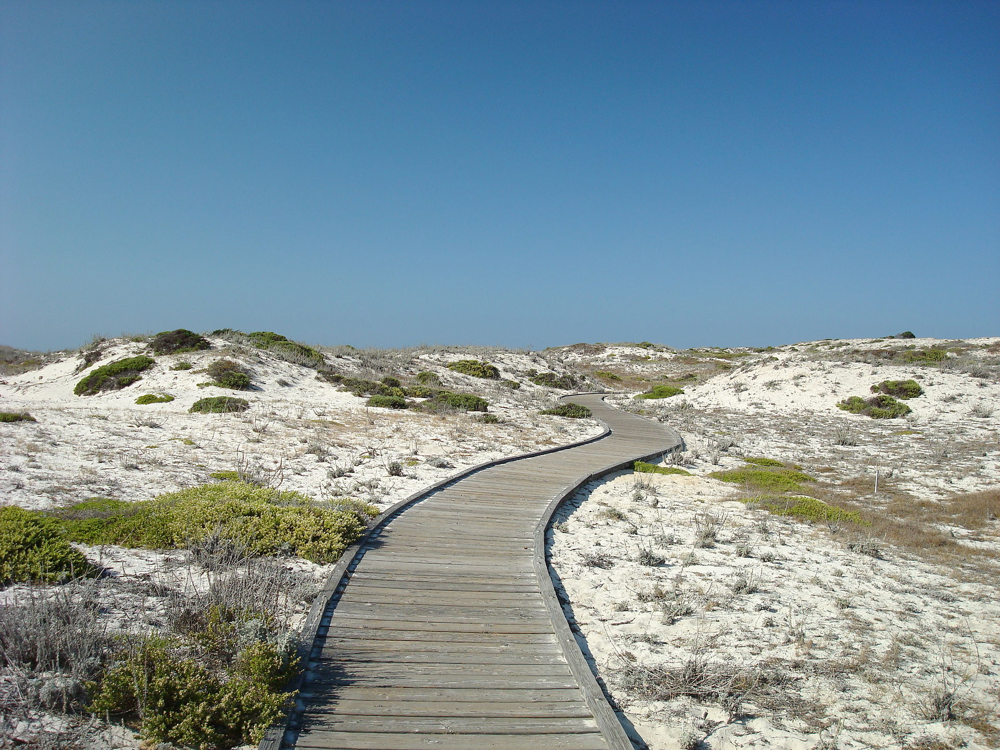
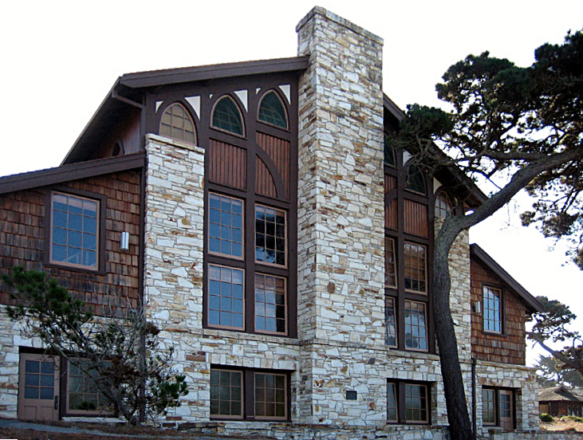

Wednesday January 10, 2018 - Friday January 12, 2018
{: style="font-size: 150%; text-align: center;"}

[Asilomar Conference Grounds](http://www.visitasilomar.com), Pacific Grove, California
{: style="font-size: 150%; text-align: center;"}

Three days of talks, open discussions, and modeling hackatons.

# Location:

StanCon 2018 will take place at the Asilomar Conference Grounds, a National
Historic Landmark on the Monterey Peninsula right on the beach.

{: style="width: 50%;" .center-image }
https://en.wikipedia.org/wiki/Asilomar_State_Beach#/media/File:Wooden_pathway_at_the_Asilomar_State_Beach.jpg
{: style="font-size: 50%; text-align: center;"}

Asilomar is approximately 120 miles south of downtown San Francisco
(about 105 miles from San Francisco International Airport) and about 75 miles
south of San Jose.

The Monterey Regional Airport (MRY) is just 8 miles from Asilomar, while Mineta
San Jose International (SJC) is 80 miles to the North and San Francisco
International Airport (SFO) is 110 miles to the North.
Local taxi companies service the Monterey Regional Airport, as does the
Monterey-Salinas Transit bus system. Airport shuttle service to and from
San Jose and San Francisco airports can be arranged in advance through
Monterey Airbus by calling 831.373.7777 or visiting the Monterey Airbus website.

Talks and discussions will take place in Merrill Hall.

{: style="width: 50%;" .center-image }
(https://en.wikipedia.org/wiki/Asilomar_State_Beach#/media/File:Merrill_Hall_Asilomar_edit1.jpg)
{: style="font-size: 50%; text-align: center;"}

# Registration:

Registration for StanCon 2018 proceeds in two steps.

* 1. First fill out the [registration information](https://goo.gl/forms/1wpXs1ANVbeFyIoQ2).

Once the registration information has been completed
you can proceed to payment.

* 2a. If you are staying at Asilomar then continue to
[the Asilomar website](https://aws.passkey.com/e/49190400)
to arrange and pay for accommodation along with the registration fee.

* 2b. If you are not staying at Asilomar then download
[the offsite registration form](/events/stancon2018/stancon_offsite_order_form.pdf)
and send a completed copy to AsilomarSales@aramark.com as instructed.

**NB:** Student scholarship applications are now closed.

~~If you are a student unable to fund attendance to this year's conference
then please consider applying for a
[student scholarship](https://goo.gl/forms/NTfbNPpcREZSr5om2), which will
cover accommodation and registration.~~

## Registration Fees

Until Friday November 10, 2017 the registration fees will be

* Student: $150
* Student ([Underrepresented Community*](#UC)): $100
* Academic: $250
* Academic ([Underrepresented Community*](#UC)): $200
* Industry: $350
* Industry ([Underrepresented Community*](#UC)): $300

After Friday November 10, 2017 all registration prices will increase by 50%.
Registrations will not be accepted after Wednesday December 20, 2017.

<a name="UC">\*</a> We are offering an optional discounted registration to anyone identifying
with as a member of an underrepresented community, including but not limited
to gender, ethnicity, and orientation.

## Onsite Accommodations

Accommodations at Asilomar cover three nights, beginning with check-in the
evening of Tuesday January 9, 2018 and continuing through check-out the
morning of Friday January 12, 2018.  Accommodations include dinner on Tuesday,
breakfast-lunch-dinner on Wednesday and Thursday, and breakfast-lunch on Friday.

* Single accommodations: $899.00
* Double accommodations: $605.93
* Quad accommodations (reserved for students): $476.00

These costs do not include an additional $20 processing fee that will be
charged when you check into your accommodation at Asilomar.

Guest accommodations are also available.  Similarly, accommodations for
preceding and subsequent days are available for those wishing to enjoy the
grounds before or after the conference.  For details see the [the Asilomar page](https://aws.passkey.com/e/49190400).

Cancellations can be made before December 10 2018 although $100 will be
deducted from any cancellation to cover processing and handling.

## Offsite Accommodations

For those planning to attend the conference but not stay on the Asilomar
grounds meals can be purchased a la carte:

* Breakfast: $19.81
* Lunch: $25.64
* Dinner: $39.87

A la carte meals also require a $12 facility fee per day.

# Contributed Talks:

Contributed talks at StanCon are based on interactive, self-contained
notebooks, such as knitr or Jupyter, and will take the place of proceedings.

Submission instructions can be found
[here](/events/stancon2018/stancon-submissions.html).

# Invited Speakers:

* Susan Holmes (Department of Statistics, Stanford University)
* Frank Harrell (School of Medicine and Department of Biostatistics, Vanderbilt University)
* Sophia Rabe-Hesketh (Educational Statistics and Biostatistics, University of California, Berkeley)
* Sean Taylor and Ben Letham (Facebook Core Data Science)
* Manuel Rivas (Department of Biomedical Data Science, Stanford University)
* Talia Weiss (Department of Physics, Massachusetts Institute of Technology)

More to come!

# Schedule:

StanCon 2018 will begin the morning of Wednesday January 10, 2018 and will close
at the end of Friday January, 12 2018.

Exact schedule coming soon!  

# Sponsors:

StanCan 2018 would not be possible without the generous support of our
sponsors.  If you are interested in becoming a sponsor then please
[contact the StanCon Organizing Committee](mailto:stancon@mc-stan.org).

# Code of Conduct

In order to facilitate a welcoming environment for all attendees, StanCon 2018
will enforce a [code of conduct](/events/stancon2018/stancon-code_of_conduct.html).

# Organizers:

- Breck Baldwin (Columbia University)
- Jonah Gabry (Columbia University)
- Daniel Lee (Stan Group Inc)
- Eric Novik (Stan Group Inc)
- Megan Shabram (NASA Ames)
- Rob Trangucci (University of Michigan)
- Lizze Wolkovich (Harvard University)
