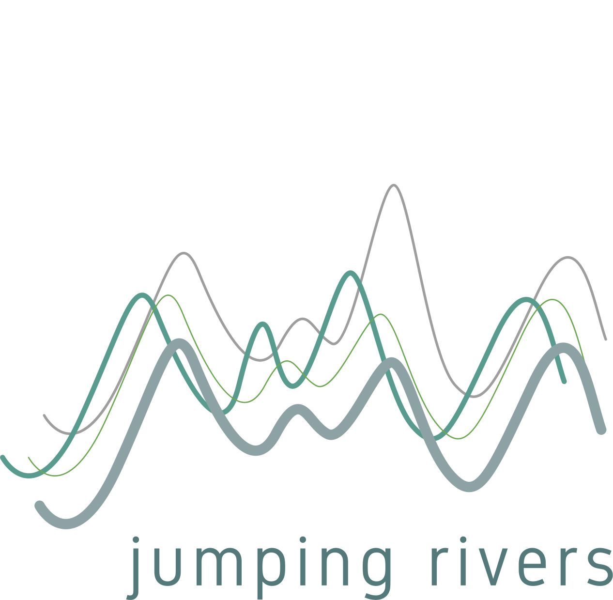

Three days of talks, open discussions, and statistical modeling.
{: style="font-size: 150%; text-align: center;"}

Jan 10-12, 2018 	&emsp; &bull; &emsp; Asilomar Conference Center, Pacific Grove, California, USA
{: style="font-size: 150%; text-align: center;"}

 
**Slides, code, and other materials from presentations at StanCon 2018 are now available at our [stancon_talks](https://github.com/stan-dev/stancon_talks) repository:** 

* [StanCon Contributed Talks Repository](https://github.com/stan-dev/stancon_talks)

Links are also provided from the conference schedule below.

------
- [**Sponsors**](#sponsors)
<!--- [**Scholarships are Back!**](#scholarships)-->
- [**Wearable Poster Session**](#poster)
- [**Location**](#location)
- [**Invitation Letters for US visa**](#letter)
- [**Registration**](#registration-information)
- [**Accommodation**](#accommodation)
- [**Speakers and Schedule**](#speakers-and-schedule)
- [**Classes/Tutorials**](#classes)
- [**Activities**](#activities)
- [**StanCon 2018 Organizing Committee**](#committee)

------

# [Sponsors](#sponsors)

Thanks to these fine folks for sponsoring StanCon2018

<!--Jumping Rivers is teaching a [Stan class](https://www.jumpingrivers.com/courses/13_introductions-to-bayesian-inference-using-rstan?utm_source=stancon2018&utm_medium=course) Dec 7, Dec 8 at Newcastle University, Newcastle Upon Tyne in the UK.

-->

------

# [Scholarships](#scholarships)

Scholarshipes are closed. 
<!--We have gotten so many requests for scholarships after the deadline that we are re-opening them. The scholarship covers staying at Asilomar and meals. You are still responsible for travel and incidentals. While this is primarily for students, tell us a good story and we will see what we can do. Scholarship [link here](https://docs.google.com/forms/d/e/1FAIpQLScztvDKhyPbyVbZwU3P1667Y-lXh2K2li4p_E5tO-BwvivpPA/viewform?usp=sf_link)
-->

------

#  [Wearable Poster Session](#poster)

We will accept poster submissions on a rolling basis until January 9th. One page exclusive of references is the desired format but anything that gives us enough information to make a decision is fine. We will accept/reject within min(48 hours,time before reception - 1 hr). Send to stancon2018@mc-stan.org or just come talk to Breck at the conference. The only somewhat odd requirement is that your poster must be "wearable" to the 5pm reception where you will be a walking presentation. Great way to network, signboard supplies will be available so you need only have sheets of paper which can be attached to signboard material.

# [Location](#location)

### [Asilomar Conference Grounds, Pacific Grove, California](https://aws.passkey.com/e/49190400/)

StanCon 2018 will take place at the Asilomar Conference Grounds, a National
Historic Landmark on the Monterey Peninsula right on the beach.

Asilomar is about 120 miles south of San Francisco and 75 miles south
of San Jose. Shuttle service is $60 each way from San Francisco airport (3 hour
trip) and $50 each way from San Jose airport (2 hour trip)
(https://www.montereyairbus.com). Shuttles run approximately every 1.5
hours. Car rental is also an option and showing rates less than $30/day as of Oct 29th.

#  [Invitation Letters for US visa](#letter)

If you require an invitation letter for visa or other purposes please fill out this [form](https://docs.google.com/forms/d/e/1FAIpQLSf-EPrWD58HLZRsJzx_JWJbaUPALPu5S-IZV-cVCdm2AkJh-w/viewform?usp=sf_link). We will email you a letter within 48 hours. You must be registered or a scholarship awardee to get the letter.

# [Registration Information](#registration-information)

IMPORTANT: Tell us your T-shirt size and tutorial/activity preferences on our [SWAG form](https://docs.google.com/forms/d/1QP_k25fWb2PB8iAKzGtNwLSP-CIeVBKMiC3n6S7izJQ).

If you are staying at the conference facility, Asilomar, then registration for the conference is handled as a part of the room booking process. Register/book room at [Asilomar](https://aws.passkey.com/e/49190400). More accomidation information below.

Offsite registration is done via [EventBrite](https://www.eventbrite.com/e/stancon-2018-tickets-38635275148). Please do not use this to register and then stay at Asilomar with some cheap deal. Our room rate covers a bunch of conference expenses. See below for meal costs.

### [Early Registration (ends Dec 15)](https://www.eventbrite.com/e/stancon-2018-tickets-38635275148)

| Student | Academic | Industry |
|:------:|:------:|:------:|
| $150 | $250 | $350 |

 

### [Regular Registration](https://www.eventbrite.com/e/stancon-2018-tickets-38635275148)

| Student | Academic | Industry |
|:------:|:------:|:------:|
| $225 | $375 | $525 |

 

We are offering $50 discounted registration to anyone identifying
with as a member of an underrepresented community, including but not limited
to gender, ethnicity, and orientation.

# [Accommodation](#accommodation)

Onsite Accommodations (will also collect payment for StanCon2018 registration)

[Book accommodations!](https://aws.passkey.com/e/49190400)

Accommodations at Asilomar include meals. Cost for 4 days, 3 nights (Jan 9-12):

* Single accommodations: $899.00
* Double accommodations: $605.93

These costs do not include an additional $20 processing fee that will be
charged when you check into your accommodation at Asilomar.

## Offsite Accommodations

For those attending the conference, but not staying at Asilomar, meals can be purchased a la carte:

* Breakfast: $19.81
* Lunch: $25.64
* Dinner: $39.87

#  [Speakers and Schedule](#speakers-and-schedule)

Going to be a pressure cooker folks. Subject to change without notice.

Merrill Hall is where StanCon2018 happens. Exceptions are meals, after dinner activities and some tutorials (Scripps Hall). 

## Wednesday, Jan 10

### Breakfast 7:30-9:00am

### Tutorials/Classes 8:00-10:00am
* 8-10 am [Intro To Stan session 1](#intro) Jonah Sol Gabry, Mitzi Morris, Sean Talts - Merrill - [(Materials)](https://github.com/jgabry/stancon2018_intro)
* 8-9 am [Bayesian Decision Making for Executives and Those who Communicate with Them 1](#exec) Eric Novik, Jonathan Auerbach - Scripps
* 9-10 am [Advanced Hierarchical Models](#advanced) Ben Goodrich - Scripps [(Slides)](AHM/AHM1.pdf)

### Break 10:00-10:40am

### Invited Talk: Predictive Information Criteria in Hierarchical Bayesian Models for Clustered Data. Sophia Rabe-Hesketh and Daniel Furr (U California, Berkely) 10:40-11:30am ([Video](https://youtu.be/FiSw6adfZcY), [Slides](https://github.com/stan-dev/stancon_talks/tree/master/2018/Invited-Talks/RabeHesketh_Furr))

* Opening Comments and Information you Need, Breck Baldwin 11:30-11:40am

* Does the New York City Police Department rely on quotas? Jonathan Auerbach (Columbia U) 11:40-12:00am [(Notebook and slides)](https://github.com/stan-dev/stancon_talks/tree/master/2018/Contributed-Talks/01_auerbach)
* Diagnosing Alzheimer's the Bayesian Way. Arya A. Pourzanjani, Benjamin B. Bales, Linda R. Petzold, Michael Harrington (UC Santa Barbara) 12:00am-12:20pm [(Notebook and slides)](https://github.com/stan-dev/stancon_talks/tree/master/2018/Contributed-Talks/02_pourzanjani)
* Joint longitudinal and time-to-event models via Stan. Sam Brilleman, Michael Crowther, Margarita Moreno-Betancur, Jacqueline Buros Novik, Rory Wolfe (Monash U, Columbia U) 12:20-12:40pm [(Notebook and slides)](https://github.com/stan-dev/stancon_talks/tree/master/2018/Contributed-Talks/03_brilleman)

### Lunch 12:40-2:00pm

* ScalaStan. Joe Wingbermuehle (Cibo Technologies) 2:00-2:20pm [(Slides)](https://github.com/stan-dev/stancon_talks/tree/master/2018/Invited-Talks/Wingbermuehle.pdf)
* A tutorial on Hidden Markov Models using Stan. Luis Damiano, Brian Peterson, Michael Weylandt 2:20-2:40pm [(Notebook and slides)](https://github.com/stan-dev/stancon_talks/tree/master/2018/Contributed-Talks/04_damiano)
* Student Ornstein-Uhlenbeck models served three ways (with applications for population dynamics data). Aaron Goodman (Stanford U) 2:40-3:00pm [(Notebook and slides)](https://github.com/stan-dev/stancon_talks/tree/master/2018/Contributed-Talks/05_goodman)
* Spatial models in Stan: intrinsic auto-regressive models for areal data. Mitzi Morris (Columbia U) 3:00-3:20pm ([Slides](https://github.com/stan-dev/stancon_talks/tree/master/2018/Invited-Talks/Morris.pdf), [Stan case study](mc-stan.org/users/documentation/case-studies/icar_stan.html))

### Break 3:20-4:00pm

### Invited Talk: Stan Applications in Physics: Testing Quantum Mechanics and Modeling Neutrino Masses, Talia Weiss (MIT) 4:00-4:50pm ([Slides](https://github.com/stan-dev/stancon_talks/tree/master/2018/Invited-Talks/Weiss.pdf))

### Reception 5:00-6:00pm

### Dinner 6:00-7pm

### After Dinner 7-9pm
* ~~Build and fly your own R/C airplane~~ Not any more folks, FAA has reinstated R/C aircraft restrictions. We will be doing air powered rockets with illumination. Don't worry, they are super fun and go really high. 
* S'mores by the outdoor fire place

## Thursday, Jan 11

### Breakfast 7:30-9:00am

### Tutorials/Classes

* 7-8am [Advanced Hierarchical Models session 2](#advanced) Ben Goodrich [Slides](AHM/AHM2.pdf)
* 8-10am [Intro To Stan session 2](#intro), Jonah Sol Gabry, Sean Talts, Mitzi Morris
* 8-9am [A Dive into Stan's C++ Model Concept](#dive) Daniel Lee
* 9-10am [How to develop for the Stan C++ Core](#core), Charles Margossian

### Break 10:00-10:40am

### Invited Talk: Forecasting at Scale: How and why we developed Prophet for forecasting at Facebook, Sean Taylor and Ben Letham (Facebook) 10:40-11:30am ([Details](https://research.fb.com/facebook-at-stancon-2018/))

<!--* NPCompare: a package for nonparametric density estimation and two populations comparison built on top of PyStan. Marco Inacio (U of São Paulo/UFSCar) 11:30-11:50am
-->
* SlicStan: a blockless Stan-like language. Maria I. Gorinova, Andrew D. Gordon, Charles Sutton (U of Edinburgh) 11:30-11:50am [(Notebook and slides)](https://github.com/stan-dev/stancon_talks/tree/master/2018/Contributed-Talks/06_gorinova)
* Introducing idealstan, an R package for ideal point modeling with Stan. Robert Kubinec (U of Virginia) 11:50am-12:10pm [(Notebook and slides)](https://github.com/stan-dev/stancon_talks/tree/master/2018/Contributed-Talks/07_kubinec)
* A brief history of Stan. Daniel Lee (Generable) 12:10-12:30pm [(Slides)](https://github.com/stan-dev/stancon_talks/tree/master/2018/Invited-Talks/Lee.pdf)

### Lunch 12:30-1:30pm

* Computing steady states with Stan's nonlinear algebraic solver. Charles C. Margossian (Metrum, Columbia U) 1:30-1:50pm [(Notebook and slides)](https://github.com/stan-dev/stancon_talks/tree/master/2018/Contributed-Talks/08_margossian)
* Bayesian estimation of mechanical elastic constants. Ben Bales, Brent Goodlet, Tresa Pollock, Linda Petzold (UC Santa Barbara)  1:50-2:10pm [(Notebook and slides)](https://github.com/stan-dev/stancon_talks/tree/master/2018/Contributed-Talks/09_bales)
* Mystery Talk, Mystery Person, 2:10-2:30

### Modeling/Data Session + Classes 2:30-4:10pm

* 2:30-4:10pm Open session for consultations on modeling and data problems with Stan developers and modelers. 
* 2:30-4:10pm [Intro to Stan Session 3](#intro) Jonah Gabry, Sean Talts, Mitzi Morris
* 2:30-3:30pm [Have I converged successfully? How to verify fit and diagnose fit problems](#fit), Bob Carpenter
* 3:30-4:10pm [Bayesian Decision Making for Executives and Those who Communicate with Them 2](#exec)  Eric Novik, Jonathan Auerbach

### Invited Talk: Stan applications in Human Genetics: Prioritizing genetic mutations that protect individuals from human disease, Manuel Rivas (Stanford U) 4:00-4:50pm [(Slides)](https://github.com/stan-dev/stancon_talks/tree/master/2018/Invited-Talks/Rivas.pdf)

### Reception 5:00-6:00pm

### Dinner 6:00-7:00pm

### After Dinner 7:00-9:00pm
* Non-snobby Blind Wine Tasting

## Friday, Jan 12

### Breakfast 7:30-9:00am

### Tutorials/Classes

* 7-8am [Advanced Hierarchical Models session 3](#advanced) Ben Goodrich [Slides](AHM/AHM3.pdf)
* 8am-10am [Intro To Stan session 4](#classes) Jonah Gabry, Sean Talts, Mitzi Morris
* 8-9 am [Bayesian Decision Making for Executives and Those who Communicate with Them 2](#exec) Eric Novik, Jonathan Auerbach

### Workshop on Model Selection: Aki Vehtari (Aalto U) 9:00-10:00am ([Materials](https://github.com/avehtari/modelselection_tutorial))

### Break 10:00-10:40am

### Invited Talk: Susan Holmes (Stanford U) 10:40-11:30am [(Slides)](https://github.com/stan-dev/stancon_talks/tree/master/2018/Invited-Talks/Holmes.pdf)

* Aggregate random coefficients logit — a generative approach. Jim Savage, Shoshana Vasserman 11:30-11:50am [(Notebook and slides)](https://github.com/stan-dev/stancon_talks/tree/master/2018/Contributed-Talks/10_savage)
* The threshold test: Testing for racial bias in vehicle searches by police. Camelia Simoiu, Sam Corbett-Davies, Sharad Goel, Emma Pierson (Stanford U) 11:50am-12:10pm [(Notebook and slides)](https://github.com/stan-dev/stancon_talks/tree/master/2018/Contributed-Talks/11_simoiu)
* Assessing the safety of Rosiglitazone for the treatment of type II diabetes. Konstantinos Vamvourellis, K. Kalogeropoulos, L. Phillips (London School of Economics and Political Science) 12:10-12:30pm ([Video](https://youtu.be/Gt73VNaZLXA), [Notebook and slides](https://github.com/stan-dev/stancon_talks/tree/master/2018/Contributed-Talks/12_vamvourellis))

### Lunch 12:30-1:30pm

* Causal inference with the g-formula in Stan. Leah Comment (Harvard U) 1:30-1:50pm [(Notebook and slides)](https://github.com/stan-dev/stancon_talks/tree/master/2018/Contributed-Talks/13_comment)
* Bayesian estimation of ETAS models with Rstan. Fausto Fabian Crespo Fernandez (Universidad San Francisco de Quito) 1:50-2:10pm [(Notebook and slides)](https://github.com/stan-dev/stancon_talks/tree/master/2018/Contributed-Talks/14_crespo)

### Invited Talk: Some problems I'd like to solve in Stan, and what we'll need to do to get there, Andrew Gelman 2:10-3:00 (Columbia U) (virtual)

# [Classes/Tutorials](#classes)

We have tutorials that start at the crack of 7am for those desiring further edification beyond the program--these do not run in parallel to the main session but do run parallel to each other--rooms to be determined (Merrill or Scripps):

- [Introduction to Stan:](#intro) Know how to program? Know basic statistics? Curious about Bayesian analysis and Stan? This is the course for you. Hands on, focused and an excellent way to get started working in Stan. Wed-Fri 8-10am, Thurs 2:30-4:10pm. Jonah Sol Gabry, Mitzi Morris, Sean Talts.

- [Executive decision making the Bayesian way:](#exec) This is for non-technical managers and technical folks who need to communicate with managers to learn the core of decision making under uncertainty. Wed 8-9am, Thurs 3:30-4:10, Friday 8-9am. Jonathan Auerback, Eric Novik.

- [Advanced Hierarchical Models in Stan:](#advanced) The hard stuff. Ben Goodrich. 9-10am Wed, 7-8am Thurs, 7-8am Friday.

- [Model assessment, selection and inference after model selection](#model) The tutorial covers cross-validation, reference predictive and projection predictive approaches for model assessment, selection and inference after model selection. I discuss when cross-validation is useful and when we can do better than cross-validation (and why not to use WAIC).  The tutorial is accommopanied with R notebooks using rstanarm, bayesplot, loo, and projpred packages. You can bring also your own data and model to get recommendations for model assessment and selection. Aki Vehtari, Thurs 8-9am

- [How to develop for Stan at the C++ level:](#develop) Overview of Stan C++ architecture and build/development process for contributors. Charles Margossian, 9-10am Thurs.

- [A Dive into Stan's C++ Model Concept](#dive) This will be a discussion partially driven by the participants. We will cover things like:
	- how the Stan language is translated to C++
	- overview of the C++ model concept that's generated
	- how to use the math library for autodiff
	- how to use the generated C++ model concept to write an inference algorithm in C++
	- opportunities in efficient computing once the C++ is generated

	Please be comfortable with C++ or at least be willing to stare at blocks of ugly code. Please have CmdStan v2.17.1 installed. Daniel Lee, 9-10am Friday.

# [Activities](#activities)
Learning is fun but we anticipate that blowing off a little steam will
be called for.

## ~~R/C Airplanes~~ Now Air Powered Rockets

R/C Airplanes are cancled due to FAA regulation changes in December. In place we will have build your own air powered rockets and they will be carrying night lights. After dinner on Wed eve we will provide designs and
building materials to create your own rocket. It takes about 15 minutes if you are quick and we will have glow sticks to put on them.  

## S'mores By the Bonfire

Pretty much self explanatory. Wed eve.

## Snob-free Blind Wine Tasting

By day 2 you will have gotten to know your fellow
attendees so some social adventure is called for. This activity has proved wildly
successful at DARPA conferences and they invented the internet so it can't be all bad.
Participants taste wines without knowing what they are.

# [Code of Conduct](#code-of-conduct)

In order to facilitate a welcoming environment for all attendees, StanCon 2018
will enforce a [code of conduct](/events/stancon2018/stancon-code_of_conduct.html).

<!--# [Sponsors](#sponsors)

We will be updating the sponsor information soon. If you're interested in sponsoring StanCon, please reach out to [stancon@mc-stan.org](mailto:stancon@mc-stan.org).

<!-- We thank our wonderful sponsors this year! -->

#  [StanCon 2018 Organizing Committee](#committee)

If you have any questions regarding StanCon, please email us at [stancon@mc-stan.org](stancon@mc-stan.org).

StanCon is organized by a volunteer community

- Breck Baldwin (Columbia University)
- Jonah Gabry (Columbia University)
- Daniel Lee (Generable, Inc)
- Eric Novik (Generable, Inc)
- Megan Shabram (NASA Ames)
- Rob Trangucci (University of Michigan)
- Lizze Wolkovich (Harvard University)
