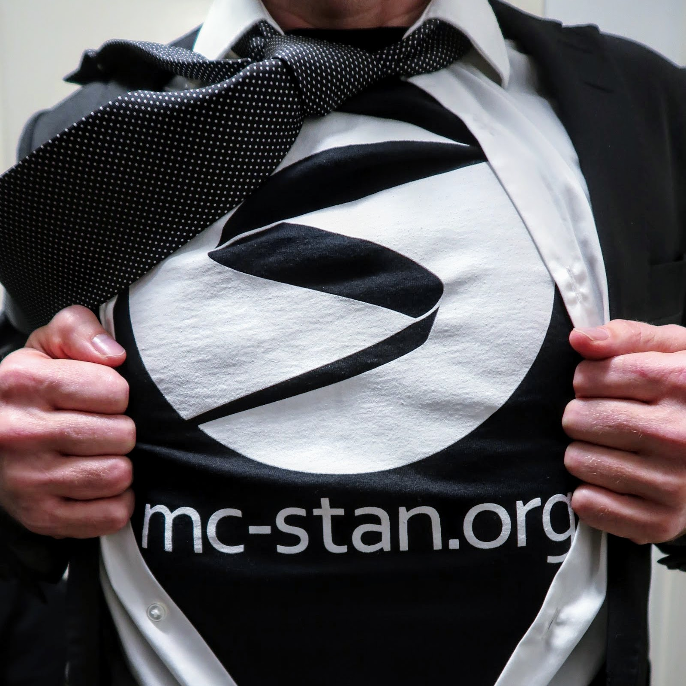
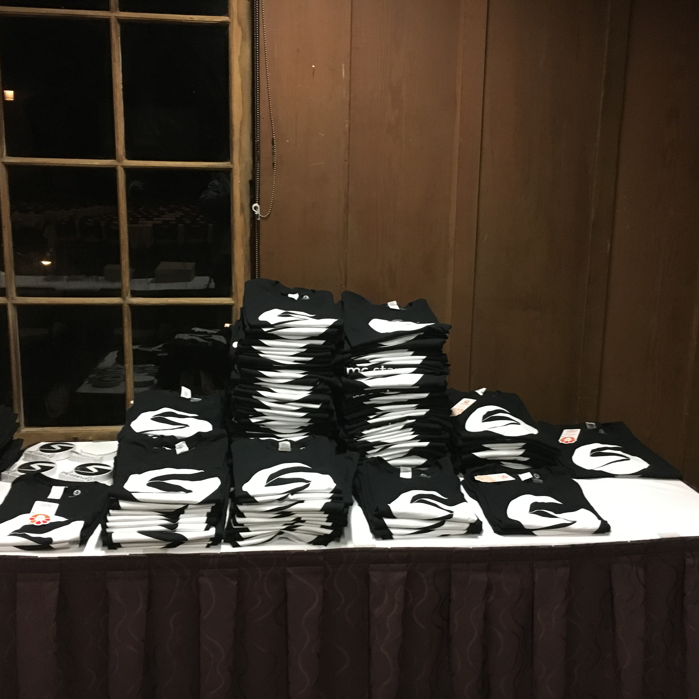
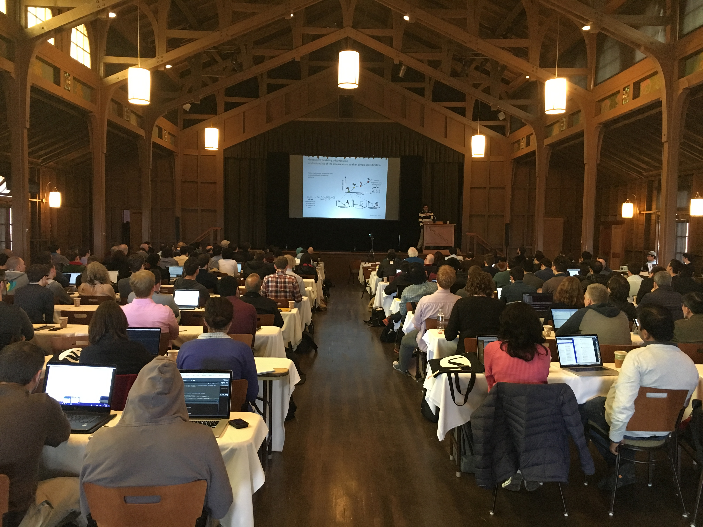
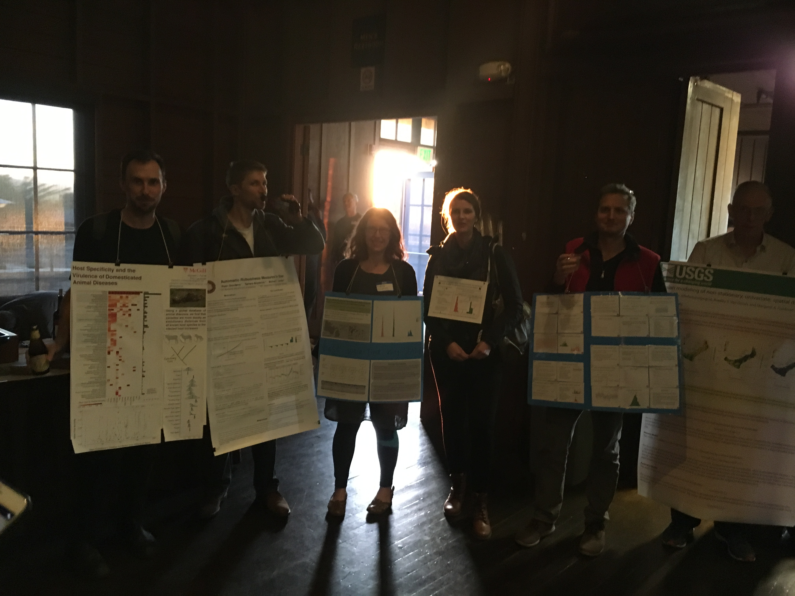
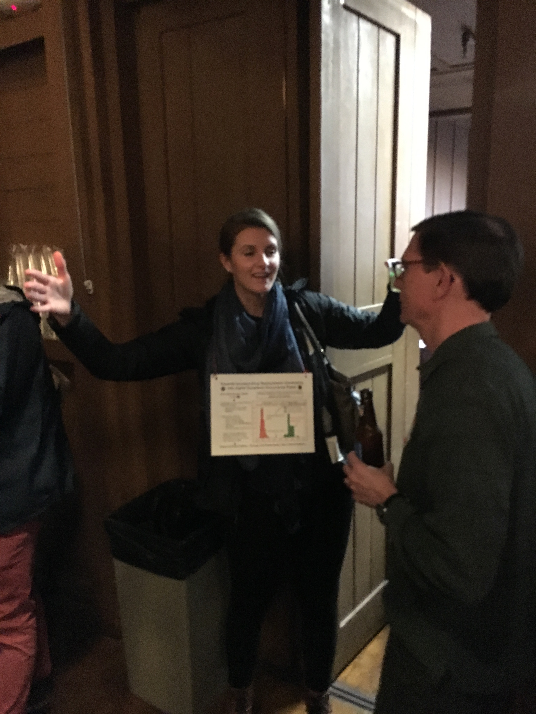
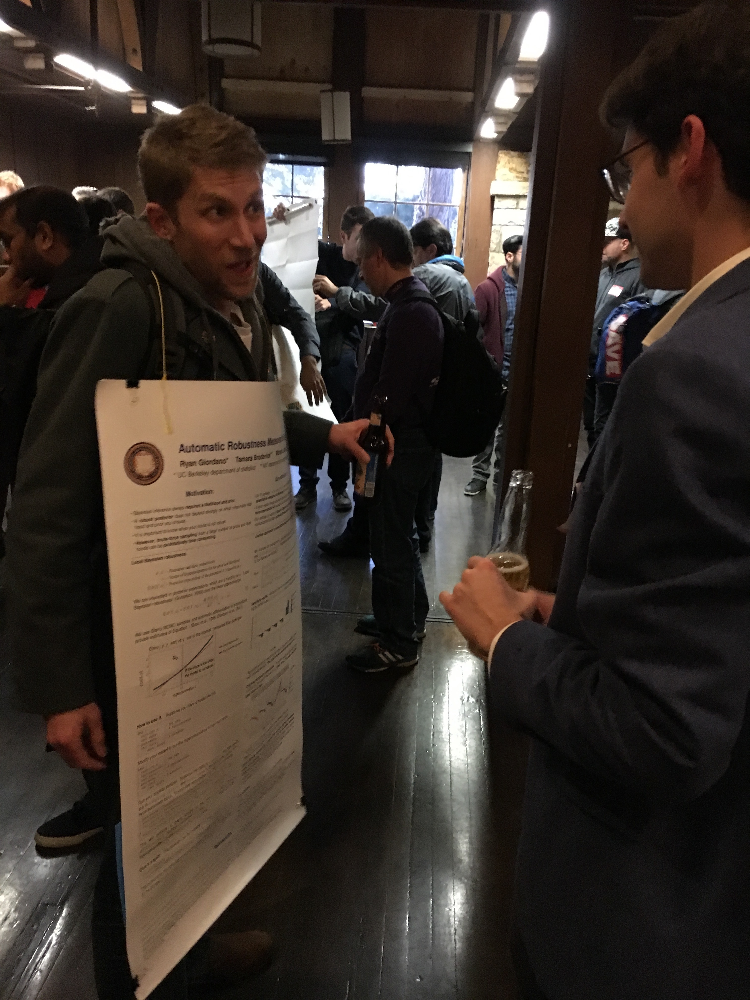
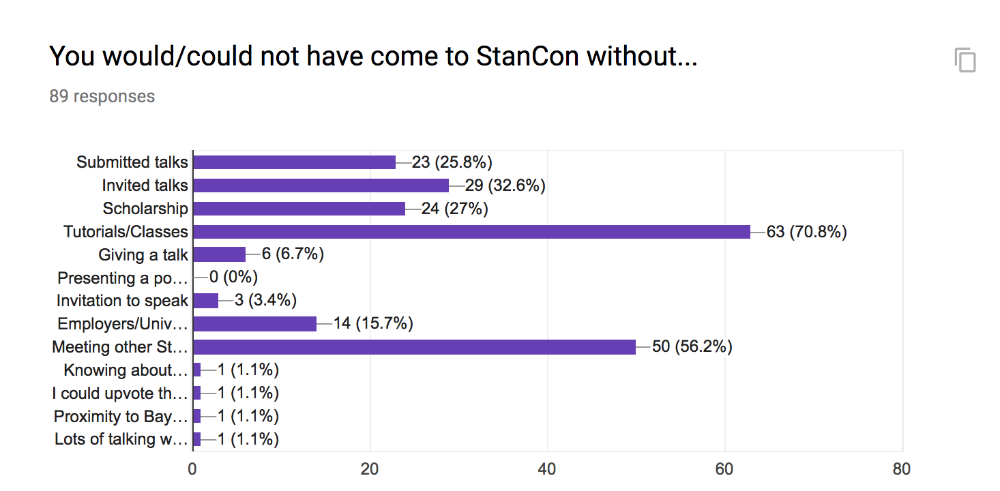
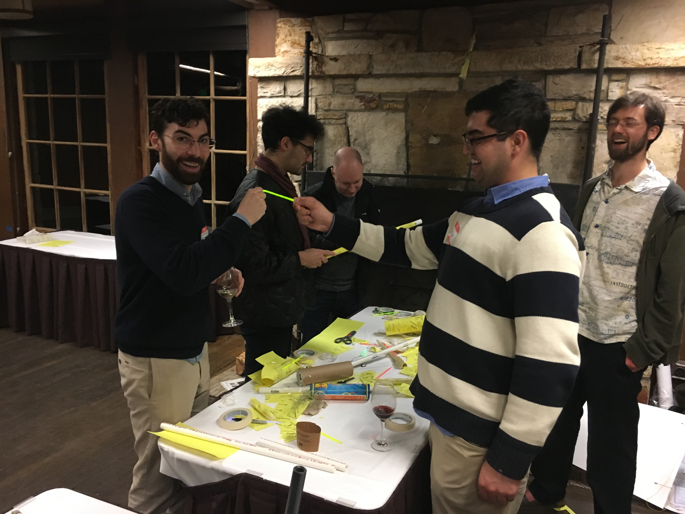
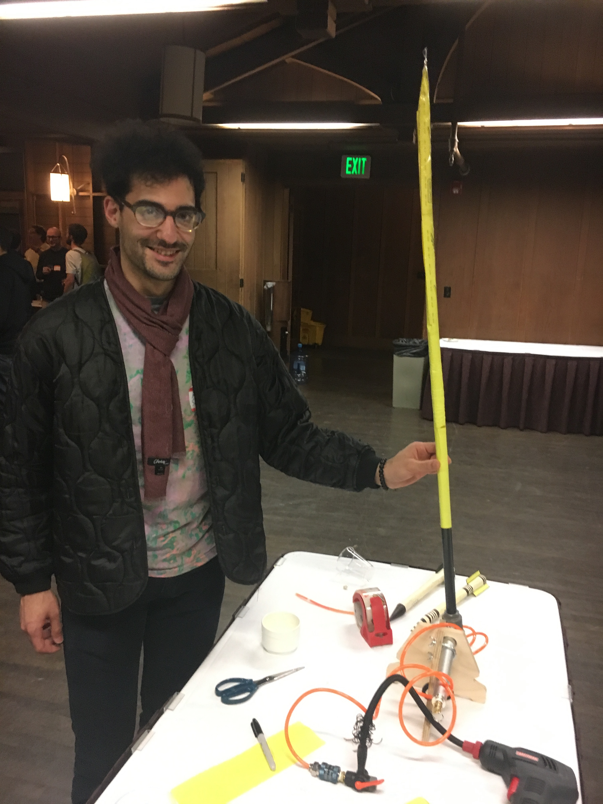

StanCon2018 Asilomar Post Event Report

</a>

Link to conference website: [http://mc-stan.org/events/stancon2018/](http://mc-stan.org/events/stancon2018/)

### Overall Observations

StanCon2018 was protected by the divine force that ensures the success of amateur theatricals and safety of small children. It worked, people had fun, they learned, they communed. 

### Background
 
StanCon2108 was setup by Michael Betancourt as a 3 day conference January 10-12 2018, at Asilomar with the invited talks. He moved on to other projects but we ran with this as the overall structure of the conference expecting 150 attendees. In the end we got 172 people to attend. 

</a>

Name that distribution. Mens t-shirts in the back, womens in the front.

### Scholarships

We elected to extend our scholarship program to take all applicants who could manage the cost of travel to Asilomar while we covered the cost of lodging and meals. This turned out to be a very positive decision and it delivered a fun, knowledge seeking audience that will carry Stan into the future. We encourage continuing to offer numerous scholarships in future StanCons. In the end we provided 50 scholarships which ended up perfectly offsetting registrations (80) and invited speakers (5) for a total of 135 which was our contracted minimum. Local attendees got us to 172 total.

### Talks 

We had 6 invited talks (40 + 10 min questions) who received room and board. One speaker dropped out and Andrew Gelman stepped up for a remote talk. We got 15 submitted talks (15 + 5 min questions) and all were accepted pending revisions. One submitted talk was retracted, we added two developer talks and had a "Mystery Talk" done by Aki for 17 total. 

</a>

### Wearable Poster Session

We modified the standard boring poster session into a "wear you poster" session at the first day reception and it was pretty much a hit. We had rolling poster acceptances until the day before the conference to help support people that could not attend without a presentation of some sort because of employer, school or other policy. 

</a>

It was a hoot.

</a>

</a>

### Tutorials

In an effort to maximize the attractiveness of StanCon we elected to have tutorials in the mornings and one afternoon session. We did not want to force people to choose between tutorials so we only allowed parallel sessions between the Intro to Stan tutorial and advanced tutorials. We surveyed attendees for tutorial interest along with t-shirt sizes and other preferences and saw tremendous interest in tutorials with 60 people interested in Intro to Stan, 79 people interested in Advanced Hierarchical Models and so on. We thought these numbers were inflated but we were wrong, if anything we got more people than expected. In a mid-conference survey (Thursday onwards) it was clear that tutorials were the major driver for attending StanCon assuming you believe that statisticians can properly read a double negative question. 

The importance of tutorials was a big surprise but made sense given that 80 people were making a 7am tutorial (Thurs and Fri), and likely missing breakfast for the 8am to 10am tutorials as well. This is an untapped and future direction for Stan teaching. We are not serving the intermediate/advanced Stan modeler well. 

### Code of Conduct

As of writing we have no code of conduct issues. We were very proactive in communicating that inappropriate behavior was not welcome. We put the code of conduct with reporting options in each registration tote on yellow paper. A standard joke that began circulating was that some behavior was a "yellow sheet violation." While we were unlikely to have issues, awareness we hope shut down any possibility of problems.

### Venue

Asilomar is beautiful, ideal and we had a lovely "summer camp vibe" to the entire event. On Thursday we had 14 hours of activities from 7am to 9pm. This cannot be replicated in a more urban environment and it significantly increased opportunities to network, learn about Stan and just have fun. 

The food was just ok, coffee suicide inducing in its crappiness but it didn't matter. Asilomar is a special place. StanCon2018 Helsinki will be a more traditional urban/academic conference that will feel very differently from 3 meals a day with fellow sufferers of a sadistic 7am start time ending with blind wine tastings and air powered rockets. 

</a>

</a>

### Video Recording
All talks were recorded except Talia Wiess because Breck screwed up. The plan is to put all videos up and annotate the conference schedule with links as well as links to the slides. Device used [Zoom Q4N](https://www.bhphotovideo.com/c/product/1218972-REG/zoom_q4n_handy_video_recorder.html). Total kit was $400 with charger, extra battery, 2 sd cards and some stuff. Thanks to Mitzi for the tripod. 

### Audio and Video
We got excellent service from [AVSI](https://www.avsolutions-inc.com/) who dealt with our dynamic situation really well. Want to ruin a conference? Get crappy A/V. These guys were on the ball. 

### Post Conference Surveys

Surveying, via Google forms, turned out to be an excellent way to anticipate attendee desires. With surveys we knew to expect 100 people at our blind wine tasting--so we had enough wine. Likewise with t-shirt sizing and tutorial attendance but we did't believe those results. Naturally we have unleashed a post conference survey. 

We are still getting results so we link to the current results: [Results](https://docs.google.com/forms/d/1NB_dV4MVD1qr0sNyHuTR4wxCOR_Bxq3jNFlbJzIC2xA/edit#responses)

### Financials

We had a lot of contracted expenses. Particularly annoying was $12,600 for catering. We, meaning Breck, elected to provide coffee at breaks at $64 a gallon, and spent the rest on booze. That was drink tix and the blind wine tasting and the s'mores. 

### Rough Breakdown

Total costs for Asilomar (scholarships, invited, AV, etc..) : $64,278

Random stuff $1,000

SWAG $2,866

AV $4,500

Total costs: $71,644

Revenues

Registrations collected by Asilomar: $25,600

EventBrite Registrations: $10,870

Sponsorships: $17,500

Total revenues: $53,970

Total Loss: -$17,674

These numbers are not verified!! But hey, buy a drink for a StanCon2018 committee member, we saved the day. 

- Breck Baldwin (Columbia University)
- Jonah Gabry (Columbia University)
- Daniel Lee (Generable, Inc)
- Eric Novik (Generable, Inc)
- Megan Shabram (NASA Ames)
- Rob Trangucci (University of Michigan)
- Lizze Wolkovich (Harvard University)

