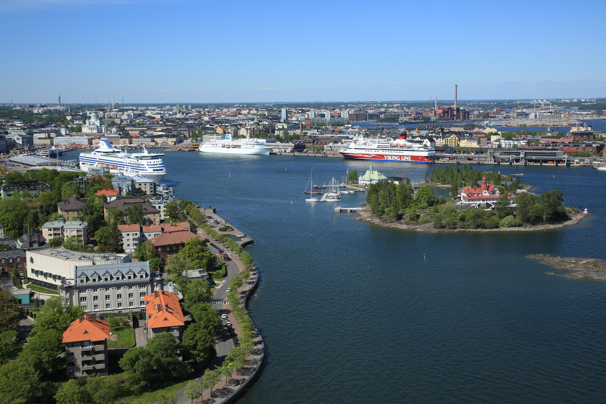
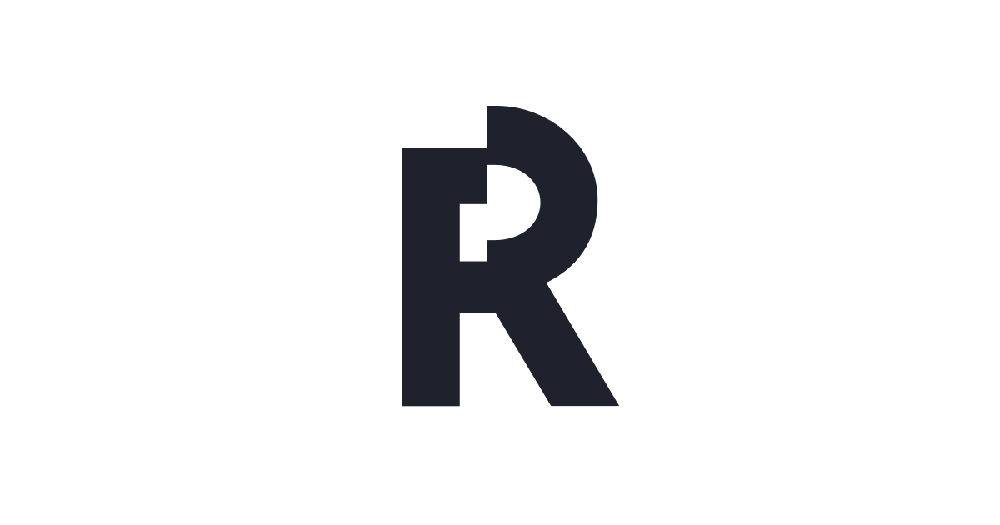
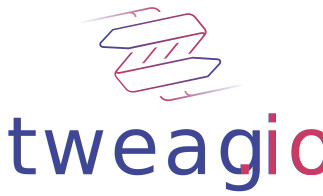
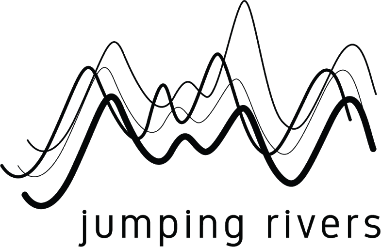
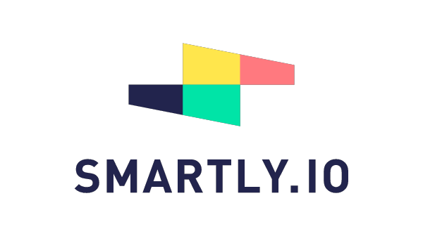
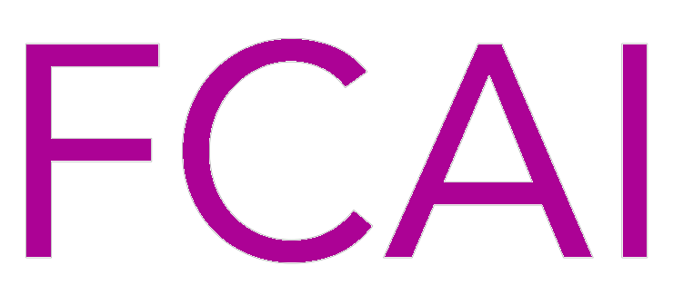
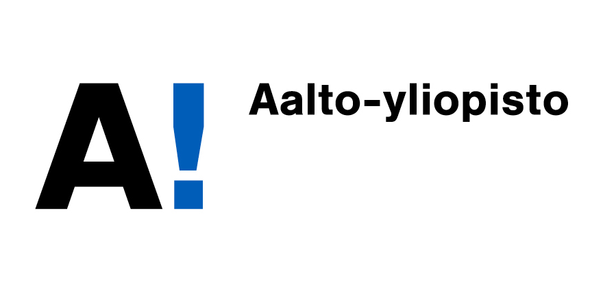

One day of tutorials and two days of talks, open discussions, and statistical modeling in beautiful Helsinki, Finland.
{: style="font-size: 150%; text-align: center;"}

August 29-31, 2018      &emsp; &bull; &emsp; Aalto University, Helsinki, Finland
{: style="font-size: 150%; text-align: center;"}

 
(c) Visit Helsinki / Jussi Hellsten.

------
- [**Sponsors**](#sponsors)
- [**Location**](#location)
- [**Overall Schedule**](#overall-schedule)
- [**Speakers and Schedule**](#speakers-and-schedule)
- [**Posters**](#posters)
- [**Tutorials**](#tutorials)
- [**StanCon 2018 Helsinki Organizing Committee**](#committee)

------

Stan (http://mc-stan.org) is a probabilistic programming and statistical modeling language used by tens of thousands of scientists, engineers, and other researchers for statistical modeling, data analysis, and prediction. It is being applied academically and commercially across fields as diverse as ecology, pharmacometrics, physics, political science, finance and econometrics, professional sports, real estate, publishing, recommender systems, and educational testing.

If you have questions regarding registration, payments, travel, please email
[stancon.helsinki2018@tavicon.fi](mailto:stancon.helsinki2018@tavicon.fi).

------

# [Location](#location)

### [Aalto University, Töölö Campus, Runeberginkatu 14-16, Helsinki, Finland](http://biz.aalto.fi/en/campus/toolo/)

StanCon 2018 Helsinki will take place 30-31 August at Aalto University Töölö Campus (Runeberginkatu 14-16, Helsinki) in the proximity of Helsinki city centre.

Tutorials on Wednesday 29th August, will be at Aalto University Otaniemi campus (Maarintie 8, Espoo) at 13min metro ride away from the Helsinki city centre.

* [Finland and Helsinki Travel Information](/events/stancon2018Helsinki/stancon-travel.html)

# [Accommodation](#accommodation)

Please make your hotel reservation directly with the hotels. We have arranged some deals with hotels and provide [a list of some recommended hotels near the venue](/events/stancon2018Helsinki/stancon-accommodation.html).

# [Overall Schedule](#overall-schedule)

|| **Wednesday 29 August, Aalto University, Otaniemi campus, Maarintie 8, Espoo** |
| 08:00 - 14:00 | Registration |
| 08:30 - 17:30 | Tutorials |
|| **Wednesday 29 August, Musiikkitalo, Mannerheimintie 13 A, Helsinki** |
| 18:30 - 21:00 | Registration |
| 19:00 - 21:30 | Get together |
|| **Thursday 30 August, Aalto University, Töölö campus, Runeberginkatu 14-16, Helsinki** |
| 08:00 - 17:00 | Registration |
| 09:00 - 18:00 | Conference |
|| **Thursday 30 August, TBD** |
| 19:30 -  | Dinner |
|| **Friday 31 August, Aalto University, Töölö campus, Runeberginkatu 14-16, Helsinki** |
| 08:00 - 10:00  | Registration |
| 09:00 - 17:00  | Conference  |

# [Speakers and Schedule](#speakers-and-schedule)

## Wednesday 29th August

Location: [Aalto University Otaniemi campus, Maarintie 8, Espoo](https://goo.gl/maps/84SJ4uRWqBA2)

08:00 - 8:30 **Registration**

08:30 - 10:00 [**Basics of Bayesian inference and Stan**](#basics)
Jonah Gabry & Lauren Kennedy

08:30 - 10:00 [**Stan C++ development: Adding a new function to Stan**](#cpp)
Bob Carpenter & Sean Talts

10:00 - 10:30 **Coffee Break**

10:30 - 12:00 [**Basics of Bayesian inference and Stan**](#basics)
Jonah Gabry & Lauren Kennedy

10:30 - 12:00 [**Stan C++ development: Adding a new function to Stan**](#cpp)
Bob Carpenter & Sean Talts

12:00 - 13:00 **Lunch**

13:00 - 14:30 [**Hierarchical models**](#hier)
Ben Goodrich

13:00 - 14:30 [**Ordinary differential equation (ODE) models in Stan**](#ode)
Daniel Lee

14:30 - 15:00 **Coffee break**

15:00 - 16:30 [**Hierarchical models**](#hier)
Ben Goodrich

15:00 - 16:30 [**Productization of Stan**](#product)
Erik Novik

16:30 - 17:30 [**Model assessment and selection**](#assessment)
Aki Vehtari

16:30 - 17:30 **Meet the developers**
TBD

19:00 - 21:30    **Get together**, [Musiikkitalo, Mannerheimintie 13 A, Helsinki](https://goo.gl/maps/UigTBs6Fnzj)

## Thursday 30th August

Location: [Aalto University, Töölö campus, Runeberginkatu 14-16, Helsinki](https://goo.gl/maps/37vpbQSFiz92)

08:45 - 09:15 **Welcome**

09:15 - 10:00 **Invited Talk: Hierarchical modelling of galaxy clusters for Cosmology**
[Maggie Lieu](https://maggielieu.com), European Space Astronomy Centre

10:00 - 10:45 **Coffee break**

10:45 - 11:45 **Contributed Talks: Session 1**

* **Arya A. Pourzanjani**, Tie Bo Wu, Benjamin B. Bales, Linda R. Petzold	*Relating Disparate Measures of Coagulapathy Using Unorthodox Data: A Hybrid Mechanistic-Statistical Approach*
* **Martin Modrák** *ODE Model of Gene Regulation*
* **Sebastian Weber** *Solving ODEs in the wild: Scalable pharmacometrics with Stan*

11:45 - 12:00 **Poster Spotlights**

12:00 - 13:00 **Lunch**

13:00 - 14:00 **Contributed Talks: Session 2**

* **Iiris Sundin**	*Using counterfactual queries to improve models for decision-support*
* **Alex Braylan**  *Self-tuning Holidays*
* **Jari Turkia**	*Modeling the Effects of Nutrition with Mixed-Effect Bayesian Network*

14:00 - 14:45 **Invited Talk: Bad Data, Big Models, and Statistical Methods for Studying Evolution**
[Richard McElreath](http://xcelab.net/rm/), Max Planck Institute for Evolutionary Anthropology

14:45 - 15:30 **Coffee Break**

15:30 - 16:30 **Contributed Talks: Session 3**

* **Paul Buerkner**	*Define Custom Response Distributions with brms*
* **Kristian Brock** *Clinical trial designs in Stan with trialr*
* **Marco Munda** *Analysis of repeated measures data in RStan*

16:30 - 16:45 **Poster Spotlights**

16:45 - 17:15 **Stan Roadmap**
**Bob Carpenter**, Columbia University

17:15 - 18:00 **Networking**

19:30 -  **Dinner**

## Friday 31st August

Location: [Aalto University, Töölö campus, Runeberginkatu 14-16, Helsinki](https://goo.gl/maps/37vpbQSFiz92)

09:00 - 09:45 **Identifying the effect of public holidays on daily demand for gas**
[Sarah Heaps](http://www.ncl.ac.uk/maths-physics/staff/profile/sarahheaps.html), Newcastle University

09:45 - 10:00 **Poster Spotlights**

10:00 - 10:45 **Coffee Break**

10:45 - 11:45 **Contributed Talks: Session 4**

* **Bruno Nicenboim** *The implementation of a model of choice: the (truncated) linear ballistic accumulator.*
* **Ville Laitinen** & Leo Lahti *A Hierarchical extension to Ornstein-Uhlenbeck-type Student’s t-processes*
* **Christopher Hammill** & Jason Lerch	*Analyzing Brain Structure Trees with Stan*

11:45 - 12:00 **Poster Spotlights**

12:00 - 13:00 **Lunch**

13:00 - 14:00 **Contributed Talks: Session 5**

* **Jonathan Auerbach,** Timothy Jones, and Robin Winstanley *Predicting New York City School Enrollment*
* **Leo Egidi**, F. Pauli & N. Torelli	*Are shots predictive of soccer results?*
* **Gertjan Verhoeven**	*Does accounting for an artificial turf advantage in Dutch football increase predictive accuracy of probabilistic models?*

14:00 - 15:00 **Contributed Talks Session 6**

* **Thomas A. Nielsen**, Dominic Steinitz & Henrik Nilsson	*Getting more out of Stan: some ideas from the Haskell bindings*
* **Yuling Yao**, Aki Vehtari, Daniel Simpson and Andrew Gelman	*PSIS-diagnostics of ADVI in Stan*
* Rok &#268;e&#353;novar, Davor Sluga, Jure Dem&#353;ar, **Steve Bronder**, Erik &#352;trumbelj	*GPU Optimized Math Routines in the Stan Math Library*

15:00 - 15:45 **Coffee Break**

15:45 - 16:30 **Stan Interface Roadmap**
**Jonah Gabry**, Columbia University

16:30 - 17:00 **Esther Williams in the Harold Holt Memorial Swimming Pool: Some thoughts on complexity**
[Daniel Simpson](https://scholar.google.co.uk/citations?user=oQIKmWUAAAAJ&hl=en), University of Toronto

## [Posters](#posters)
**Shrinkage priors for Bayesian penalized regression**   
van Erp, S., Oberski, D. L. & Mulder, J.    
**Kinetic modelling of cocoa bean fermentation: An application of Bayesian parameter estimation using RStan**  
Moreno-Zambrano, M., Grimbs, S., Ullrich M. S., & Hütt, M.    
**Hierarchical Bayes goes marine: building propulsion power prediction models with Stan**  
Solonen, A., Laine, M. & Haario, H.    
**Who drinks in South Africa, and how much? Integrating multiple sources of information to estimate alcohol consumption trends**   
Cois, A.    
**Estimating flood probability Bands Using Flood Event Data - a case study on the importance of specifying prior distributions**  
Prosdocimi, I.  
**Relating the development of maternal Post-Traumatic Stress to Health Related Quality of Life of children with severe burn injuries. **  
Veen, D., Egberts, M.R., Veen, D., van de Schoot, R. & van Loey, N.E.E.    
**Bayesian inference with partial differential equations using Stan and adjoint sensitivity analysis**  
Zhang, Y. & Gillespie, W. R.    
**Hierarchical Gaussian modelling of instantaneous heart rate distributions**  
Korpela, J.  
**Using counterfactual queries to improve models for decision-support**    
Sundin, I., Schulam, P., Siivola, E., Vehtari, A., Saria,  S. & Kaski, S.    
**Hierarchical Bayesian approach for modelling region- and event-level variability in flood damaging processes**  
Sairam, N.,  Schröter, K. & Kreibich, H.    
**Can predicting data improve model interpretation and inferences? Using Stan to fight the assumption of independence.**  
Bartoš, F., Lukavský,J. & Děchtěrenko, F.    
**ctsem – hierarchical continuous time state space modelling for R**  
Driver, C.   
**Modelling the effect of billboard advertising on online sales with Rstan**   
Groß, M.  
**V-Dem: Aggregating Expert Opinion on Democracy with IRT Models**  
V-Dem Institute  
**Type M error in practice: A case study**  
Vasishth, S., Mertzen, D. Jäger L., Gelman, A.  
**Age period cohort models with unequal time intervals**  
Smith, T.  
**Qualifying drug dosing regimens in pediatrics using Gaussian Processes**  
Siivola, E.	Weber, S. & Vehtari, A.   
**TBA**  
Mackerodt, J.  
**Bayesian inference of protein conformational ensembles from limited structural data**  
Potrzebowski, W.  
**Using STAN to Explore Fairness in University Admission Policies**  
Mathioudakis, M., Castillo, C.  
**A Trial By Fire: Presenting A Prospective Bayesian Analysis Plan To a Room of Statisticians.**  
Clark, O.   
**Bayesian model for the destruction of bacteria and bacterial spores under heat treatments**  
Ilvonen, L., Honkela, A.   
**Bayesian Regularized Mediation Analysis**  
van Kesteren, E. 	Oberski, D.   
**Forecasting a Stock’s Remaining Intraday Volume**  
Bari, O. 	Constandache, A.

## [Get together](#gettogether)

Get together event will be on Wednesday evening at [Musiikkitalo, Mannerheimintie 13 A, Helsinki](https://goo.gl/maps/UigTBs6Fnzj) (included in the registration fee)

## [Dinner](#dinner)

Conference dinner will be on Thursday evening (included in the
registration fee).

# [Tutorials](#tutorials)

Pre-conference tutorials led by Stan developers are organized for 29th August 2018 at [Aalto University Otaniemi campus, Maarintie 8, Espoo](https://goo.gl/maps/84SJ4uRWqBA2), 13mins metro ride away from Helsinki city center. There are two parallel sessions. The tutorial sessions are:

* **Basics of Bayesian inference and Stan** (morning half day), [Jonah Gabry](https://jgabry.github.io/) & [Lauren Kennedy](https://www.linkedin.com/in/lauren-kennedy-783864bb)
 In this tutorial we will first review some of the foundational concepts in Bayesian statistics that are essential background for anyone interested in using Bayesian methods in practice. Then we will introduce the Stan language and the recommended workflow for applied Bayesian data analysis by working through an example analysis together. Since we only have 1/2 day for this tutorial it will be beneficial for participants to have at least some previous experience with statistical modeling, but prior experience fitting Bayesian models is not a requirement.
 
This session will be helpful preparation for anyone interested in attending the afternoon session on hierarchical modeling.
We will be interfacing with Stan from R, but users of Python and other languages/platforms can still benefit from the tutorial as all of the code we write in the Stan language (and all of the modeling techniques and concepts covered) can be used with any of the Stan interfaces.

* **Hierarchical models** (afternoon half day), [Ben Goodrich](https://github.com/bgoodri)
  Hierarchical models are and should be the default way to conduct a Bayesian analysis. By hierarchical Bayesian models, we mean any generative process where the distribution for some unknown depends on one or more other unknowns. This includes instrumental variables, interaction terms, hierarchical shrinkage priors and many others. However, the most common instance of a hierarchical model is one where the generative process allows some of the parameters to vary by group, which can be conveniently specified using the syntax of the **lme4** R package. In this tutorial we will start with estimating and interpreting estimates of hierarchical models using the `stan_glmer` function in the **rstanarm** R package, proceed to the `brm` function in the **brms** R package, and finish with some examples where participants modify or write code in the Stan language to specify a hierarchical model.
  Prerequisites: Some experience with R (not necessarily the aforementioned packages) and some experience with MCMC (not necessarily Stan).

* **Stan C++ development: adding a new function to Stan** (morning half day), [Bob Carpenter](http://bob-carpenter.github.io/) and [Sean Talts](https://github.com/seantalts)
  This tutorial will prepare you to submit your first pull
request for Stan's C++ libraries.  We will cover all of the
steps required to add a new function with analytic gradients
to the Stan language, including creating the issue, branching
in GitHub, code organization and style, unit testing, continuous
integration, code review, API and user-facing documentation, and
merging.  In addition to the process, we will survey the math library,
including scalar and matrix data types, automatic differentiation,
and template traits and metaprograms.

* **Ordinary differential equation (ODE) models in Stan** (afternoon 1.5 hours), [Daniel Lee](https://www.generable.com/about/)
  This tutorial will cover the usage of the ordinary differential equation (ODE) solvers
from within the Stan language. It will be a hands-on session where we'll learn to specify ODEs
as functions, the use of the ODE integrators, and practical tips on packing and unpacking the
arguments to the function.
 
This tutorial is meant to be hands-on. Please be familiar with running Stan models from
the interface of your choice. It will help to know the difference between arrays of `real` and
`vector` types (see Ch. 26 "Matrices, Vectors, and Arrays").

* **Productization of Stan** (afternoon 1.5 hours), [Eric Novik](https://www.generable.com/about/)
 
We all love Stan for its expressivity and flexibility, and for making state-of-the-art
NUTS sampler available to a broad community of statisticians, econometricians,
pharmacometricians, data scientists, and many other quantitative analysts.
 
What we don't love is munging and mapping data into Stan, slowly iterating over
many models, and deploying models into production for use by non-specialists.
Integrating a robust Bayesian workflow from research into production is not trivial
but it is extremely rewarding as it puts the product of our work in the hands
of people who need it most.
 
Many organizations have started doing this with Stan and there are some patterns
of use as well as anti-patterns that are emerging as a result. In this session, we will
present several approaches to productizing Stan and discuss their strengths
and weaknesses.

* **Model assessment and selection** (afternoon 1 hour), [Aki Vehtari](https://users.aalto.fi/~ave/)
 In this tutorial I will review estimation of predictive performance of models in M-open seetting where we assume that none of the models is the true model. When we don't trust our models, we can re-use data as a model-free proxy for the future data distribution. To adjust for data re-use we use leave-one-out cross-validation for exchangeable observations, K-fold cross-validation for group exchangeable observations, and m-step ahead validation for time series. I present how these performance estimates and related predictive distributions can be used for model comparison, averaging and checking. I discuss fast importance sampling approximation including useful diagnostics. Finally I discuss relations to alternative methods for model selection and weighting.
 
Tutorial demonstrations are based on R with rstan, rstanarm, brms and loo packages.

# [Code of Conduct](#code-of-conduct)

In order to facilitate a welcoming environment for all attendees, StanCon 2018
will enforce a [code of conduct](/events/stancon2018Helsinki/stancon-code_of_conduct.html).

# [Sponsors](#sponsors)

Generous contributions from our sponsors ensure that our registration costs are kept as low as possible and allow for us to subsidize attendance for students who would otherwise be unable to attend.

If you're interested in sponsoring StanCon 2018 Helsinki, please reach out to [stancon2018helsinki@mc-stan.org](mailto:stancon2018helsinki@mc-stan.org).

#  [StanCon 2018 Helsinki Organizing Committee](#committee)

If you have questions regarding registration, payments, travel, please email
[stancon.helsinki2018@tavicon.fi](mailto:stancon.helsinki2018@tavicon.fi).

For other questions regarding StanCon Helsinki, please email us at [stancon2018helsinki@mc-stan.org](mailto:stancon2018helsinki@mc-stan.org).

StanCon is organized by a volunteer committee:

* Aki Vehtari (Aalto University)
* Breck Baldwin (Columbia University)
* Jonah Gabry (Columbia University)
* Lauren Kennedy (Columbia University)
* Daniel Lee (Generable)

Local organization committee in Helsinki:

* Eero Siivola (Aalto University)
* Juho Piironen (Aalto University)
* Topi Paananen (Aalto University)
* Tuomas Sivula (Aalto University)
* Michael Riis Andersen (Aalto University)
* Akash Dhaka (Aalto University)
* Shrikanth Gadicherla (Aalto University)
