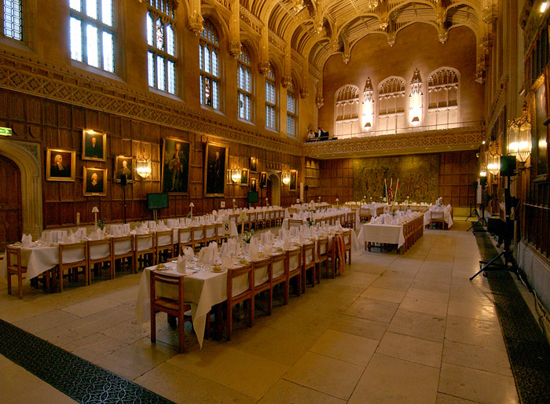
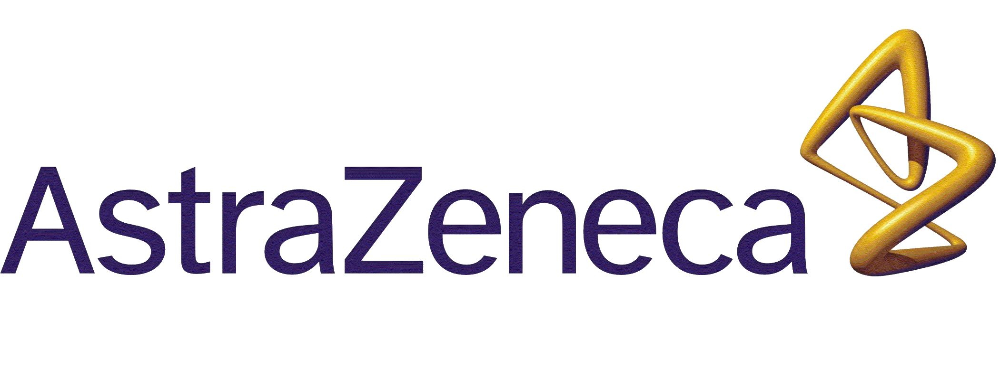

StanCon 2019 is open for registration. Two days of tutorials followed by two days of talks, open discussions, and statistical modeling.
{: style="font-size: 150%; text-align: left;"}

### [Registration Information Here](#registration)

------
- [**Sponsors**](#sponsors)
- [**Dates**](#dates)
- [**Location**](#location)
- [**34 Accepted Presentations (opens new page)**](https://mc-stan.org/events/stancon2019Cambridge/abstracts.html)
- [**Tutorials**](#tutorials)
- [**Schedule**](#schedule)
- [**Lodging**](#lodging)
- [**Travel**](#travel)
- [**Contact**](#contact)

------

# [Dates](#dates)
<ul>
<li>Tutorials: August 20-21, 2019</li>

<li>Conference: August 22-23, 2019</li>

<li> Conference Dinner: August 22, 2019</li>

</ul>
# [Location](#location)

Tutorials (see maps below): 

King's College
King's Parade
Cambridge CB2 1ST

Caius College
Trinity Street
Cambridge
CB2 1TA

Conference: 

West Road Concert Hall
University of Cambridge
11 West Road, Cambridge CB3 9DP UK

<a href="img/CambridgeLarge.png">Map of all venues</a>

<a href="img/annotated_kings.pdf">Annotated Kings College Map. Track 2, 3 Tutorials, Conference and Conference Dinner</a>

<a href="img/old-courts-map_1.png">Annoatated Caius College Map (Track 1 Tutorial "Basics of Bayesian inference and Stan"), Bateman Room and Auditorium)</a>

# [Tutorials](#tutorials)

## Track 1

<a href="img/old-courts-map_1.png">Bateman Hall Map</a>

<b>Basics of Bayesian inference and Stan. </b>August 20, 21 all day. Instructors Jonah Gabry and Lauren Kennedy. 

<b>Description:</b> In this tutorial we will first review some of the foundational concepts in Bayesian statistics that are essential background for anyone interested in using Bayesian methods in practice. Then we will introduce the Stan language and the recommended workflow for applied Bayesian data analysis by working through an example analysis together. Since we only have 2 days for this tutorial it will be beneficial for participants to have at least some previous experience with statistical modeling, but prior experience fitting Bayesian models is not a requirement. 
We will be interfacing with Stan from R, but users of Python and other languages/platforms can still benefit from the tutorial as all of the code we write in the Stan language (and all of the modeling techniques and concepts covered) can be used with any of the Stan interfaces.

## Track 2

<a href="img/annotated_kings.pdf">Saltmarsh Room Map</a>

**Introduction to Stan for Programmers. No statistics background required.** August 20, 21 mornings with afternoon exercises. R/Python based introduction to both Stan and statistics. Instructors Jonathan Auerbach, Breck Baldwin.

**Description:** This class is for those who don't know statistics, extremely rusty with statistics or just want a gentle introduction to Bayesian modeling the Stan way. This tutorial will not cover as nearly much ground as the above class but will get you working with the basics of Bayesian modeling so that you can proceed to learn more. Most importantly we get you through the awkward 'no idea phase' of learning a new technology to having a basic understanding of how to work with the software. We will cover the mechanics of how Stan programs work, show simple examples of regression and pooling. We presuppose that you are comfortable with general programming concepts like subroutines, variable assignment and use of IDEs. Both the R and Python interfaces to Stan will be covered. 

**A Dive into Stan’s C++ Model Concept** August 20, afternoon. Instructor Daniel Lee. 

**Description:** This will be a discussion partially driven by the participants. We will cover things like: 

* how the Stan language is translated to C++ 
* overview of the C++ model concept that’s generated 
* how to use the math library for autodiff 
* how to use the generated C++ model concept to write an inference algorithm in C++ 
* opportunities in efficient computing once the C++ is generated

Please be comfortable with C++ or at least be willing to stare at blocks of ugly code. Please have CmdStan installed.

**Model assessment and selection** August 21, afternoon. Instructor Aki Vehtari.

**Description** In this tutorial I will review estimation of predictive performance of models in M-open setting where we assume that none of the models is the true model. When we don’t trust our models, we can re-use data as a model-free proxy for the future data distribution. To adjust for data re-use we use leave-one-out cross-validation for exchangeable observations, K-fold cross-validation for group exchangeable observations, and m-step ahead validation for time series. I present how these performance estimates and related predictive distributions can be used for model comparison, averaging and checking. I discuss fast importance sampling approximation including useful diagnostics. Finally I discuss relations to alternative methods for model selection and weighting. 
Tutorial demonstrations are based on R with rstan, rstanarm, brms and loo packages.

## Track 3

<a href="img/annotated_kings.pdf">Keynes' Hall Map</a>

**Hierarchical Modeling with Stan**. August 20, 21 mornings. Instructor Ben Goodrich. 

**Description:** Hierarchical models are and should be the default way to conduct a Bayesian analysis. By hierarchical Bayesian models, we mean any generative process where the distribution for some unknown depends on one or more other unknowns. This includes instrumental variables, interaction terms, hierarchical shrinkage priors and many others. However, the most common instance of a hierarchical model is one where the generative process allows some of the parameters to vary by group, which can be conveniently specified using the syntax of the lme4 R package. In this tutorial we will start with estimating and interpreting estimates of hierarchical models using the stan_glmer function in the rstanarm R package, proceed to the brm function in the brms R package, and finish with some examples where participants modify or write code in the Stan language to specify a hierarchical model. 
Prerequisites: Some experience with R (not necessarily the aforementioned packages) and some experience with MCMC (not necessarily Stan).

**Population and ODE-based models using Stan and Torsten**. August 20, 21 afternoons. Instructors Charles Margossian, Yi Zhang.

**Description** 

This class covers techniques to build, fit, and criticize Bayesian models in pharmacometrics. When handling such models, we must address the following challenges: (i) the data generating process involves solutions to ODE systems; (ii) these ODEs are embedded in a complicated event schedule; (iii) the data comes from various sources, for instance various patients and studies, and the resulting models are hierarchical. Note that these properties are not specific to pharmacometrics, and arise in other fields such as epidemiology, geology, and econometrics. To accommodate a broad audience, we will keep the core concepts general, and review basic notions of pharmacometrics, so that participants from all fields can do the exercises.

The course reviews elementary techniques to solve ODEs in Stan, the efficient parametrization of hierarchical models, and within-chain parallelization. We also introduce Torsten, an extension of Stan for pharmacometrics, which allows us to seamlessly combine the above methods. We will give participants access to a cloud platform, so that users may use multiple cores when parallelizing Stan and Torsten. Original tutorial abstract [here](https://mc-stan.org/events/stancon2019Cambridge/pharmaTutorialProposal.pdf).

# [Schedule](#schedule)

The overall schedule is two days of tutorials, August 20, 21, followed by two days of conference, August 22, 23. 

Subject to change. 

## Tuesday, August 20, Tutorials

<ul>
<li>8:00am-9:00am Registration <a href="img/annotated_kings.pdf">Chetwynd Room</a></li>
<li>9:00am-11:30am Tutorials with Break
	<ul>
	<li>Track 1: Basics of Bayesian inference and Stan. <a href="img/old-courts-map_1.png">Bateman Hall</a></li>
	<li>Track 2: Stan for Programmers. <a href="img/annotated_kings.pdf">Saltmarsh Room</a> </li>
	<li>Track 3: Hierarchical Modeling with Stan. <a href="img/annotated_kings.pdf">Keynes' Hall</a> </li>
	</ul>
	</li>
<li>11:30am-12:30pm Open Developers Meeting, <a href="img/annotated_kings.pdf">Chetwynd Room</a> (loo, projpred, bayesplot, discourse)</li>
<li>12:30pm-2:00pm Provided Lunch</li>
<li>2:00pm-4:30pm Tutorials with Break
	<ul>
	<li>Track 1: Basics of Bayesian inference and Stan. <a href="img/old-courts-map_1.png">Bateman Hall</a></li>
	<li>Track 2: A Dive into Stan’s C++ Model Concept <a href="img/annotated_kings.pdf">Saltmarsh Room</a> </li>
	<li>Track 3: Population and ODE-based models using Stan and Torsten <a href="img/annotated_kings.pdf">Keynes' Hall</a> </li>
	</ul>
	</li>
<li>4:30pm-5:30pm Open Developers Meeting, <a href="img/annotated_kings.pdf">Chetwynd Room</a> (posteriordb = reference model and posterior database, bayesbenchr = framework for benchmarking inference algorithms)</li>
<li>5:00pm-7:00pm Bar</li>

</ul>

## Wednesday, August 21, Tutorials
<ul>
<li>8:00am-9:00am Registration <a href="img/annotated_kings.pdf">Chetwynd Room</a></li>
<li>9:00am-11:30am Tutorials with Break
	<ul>
	<li>Track 1: Basics of Bayesian inference and Stan. <a href="img/old-courts-map_1.png">Bateman Hall</a></li>
	<li>Track 2: Stan for Programmers. <a href="img/annotated_kings.pdf">Saltmarsh Room</a> </li>
	<li>Track 3: Hierarchical Modeling with Stan. <a href="img/annotated_kings.pdf">Keynes' Hall</a> </li>
	</ul>
	</li>
<li>11:30am-12:30pm Open Developers Meeting, <a href="img/annotated_kings.pdf">Chetwynd Room</a> (bayesflow for Bayesian workflow, parallelization, optimization, KINSOL solver)</li>
<li>12:30pm-2:00pm Provided Lunch</li>
<li>2:00pm-4:30pm Tutorials with Break
	<ul>
	<li>Track 1: Basics of Bayesian inference and Stan. <a href="img/old-courts-map_1.png">Bateman Hall</a></li>
	<li>Track 2: Model assessment and selection <a href="img/annotated_kings.pdf">Saltmarsh Room</a> </li>
	<li>Track 3: Population and ODE-based models using Stan and Torsten <a href="img/annotated_kings.pdf">Keynes' Hall</a> </li>
	</ul>
	</li>
<li>4:30pm-5:30pm Open Developers Meeting, <a href="img/annotated_kings.pdf">Chetwynd Room</a> (sparse matrices, Laplace for GLVMs)</li>
<li>5:00pm-7:00pm Bar</li>

</ul>

## Thursday, August 22, Conference
<ul>
<li>8:00am-9:00am Registration <s><a href="img/annotated_kings.pdf">Chetwynd Room</a></s><a href="img/CambridgeLarge.png">West Road Concert Hall</a></li>
<li>9am-10am Submitted Talks
<ul>
<li> <i><b>Prior choice in logit models of discrete choice</b></i>. Jim Savage. <a href="abstracts.html#14">Abstract</a></li>
	<li><i><b>Approximate leave-future-out cross-validation for Bayesian time series models</b></i>. Paul Bürkner, Jonah Gabry, Aki Vehtari. <b></b> <a href="abstracts.html#20">Abstract</a></li>
	<li><i><b>The Currency of Place and the Short-Term Rental Market</b></i>. Mikael Brunila. <b></b> <a href="abstracts.html#24">Abstract</a></li>
</ul></li>

<li> 10am-10:40am Break </li>
<li>10:40am-11:40am Submitted Talks
	<ul>
	<li><i><b>Modelling enzyme kinetics with Stan</b></i>. Teddy Groves. <b>DTU BIOSUSTAIN Quantitative Modelling of Cell Metabolism Team</b> <a href="abstracts.html#17">Abstract</a></li>
	<li><i><b>The emergence of HIV resistance to antiretroviral therapy in southern Africa: a mechanistic meta-analysis of survey data</b></i>. Julien Riou, Matthias Egger, Christian Althaus. <b>Institute of Social and Preventive Medicine, University of Bern, Switzerland</b> <a href="abstracts.html#18">Abstract</a></li>
	<li><i><b>Handling missing data, censored values and measurement error in machine learning models using multiple imputation for early stage drug discovery</b></i>. Rowan Swiers. <b>AstraZeneca</b> <a href="abstracts.html#19">Abstract</a></li>
	</ul></li>
	
<li>11:40-12:00pm Sponsor Talks and Birds of Feather</li>
<li>12:00pm-1:00pm Provided Lunch</li>
<li>1:00pm-2:00pm Stan Community Meeting</li>
<li>2:00pm-3:00pm Submitted Talks
	<ul>
<li><i><b>Fast Forward Like a Lambo (skrrt skrrt)</b></i>. Daniel Lee. <b>Generable</b> <a href="abstracts.html#23">Abstract</a></li>
	<li><i><b>Profit-Maximizing A/B Tests</b></i>. Elea McDonnell Feit, Ron Berman. <b>The Wharton School</b> <a href="abstracts.html#25">Abstract</a></li>
		<li><i><b>When seasonality meets Bayesian: Decomposing seasonalities in Stan</b></i>. Hyunji Moon, SNU, Hyeonseop Lee, PUBG. <b></b> <a href="abstracts.html#21">Abstract</a></li>
	</ul>
</li>
<li>3:00pm-3:40pm Break</li>
<li>3:40pm-4:20pm Submitted Talks
	<ul>
		<li><i><b>Chronikis: a Bayesian time-series modeling language</b></i>. Kevin S. Van Horn. <b>Adobe Inc.</b> <a href="abstracts.html#27">Abstract</a></li>
		<!--<li><i><b>Parallel numerical ODE solution in Torsten for population models</b></i>. Yi Zhang,  William R. Gillespie. <b>Metrum LLC</b> <a href="abstracts.html#2">Abstract</a></li>
		-->
	</ul>
</li>
<li>4:20pm-5:10pm David Spiegelhalter <i><b>Communicating Uncertainty about Facts, Numbers and Science</b></i></li>
<li>5:10pm-6:30pm: Networking at the Pub and pickup football(soccer) match</li>
<li>6:30pm Dinner at King's College</li>

</ul>
## Friday, August 23
<ul>
<li>8:00am-9:00am Registration <s><a href="img/annotated_kings.pdf">Chetwynd Room</a></s><a href="img/CambridgeLarge.png">West Road Concert Hall</a></li>
<li>9:00am-10:00am Submitted Talks
	<ul>
	<li><i><b>Using the Stan Math Library to reduce memory consumption for tape-based Algorithmic Differentiation (AD)</b></i>. Philip Maybank. <b>Numerical Algorithms Group (NAG)</b> <a href="abstracts.html#9">Abstract</a></li>
	<li><i><b>The State of GPU Computation Support for Stan</b></i>. Rok Češnovar (University of Ljubljana - UL), Steve Bronder (Capital One), Davor Sluga (UL), Jure Demšar (UL), Tadej Ciglarič (UL), Sean Talts (Columbia University), Erik Štrumbelj (UL). <b></b> <a href="abstracts.html#10">Abstract</a></li>
	<li><i><b>Modeling cocoa bean fermentation processes</b></i>. Mauricio Moreno-Zambrano, Sergio Grimbs, Matthias S. Ullrich and Marc-Thorsten Hütt. <b> Department of Life Sciences & Chemistry, Jacobs University Bremen</b> <a href="abstracts.html#16">Abstract</a></li>
	</ul></li>
	
<li> 10am-10:40am Break </li>
<li>10:40am-12:00pm Submitted Talks
	<ul>
<li><i><b>Bayesian analyses of time-to-event data using the rstanarm R package</b></i>. Eren M. Elçi, Sam Brilleman. <b>Public Health and Preventive Medicine, Monash University.</b> <a href="abstracts.html#15">Abstract</a></li>
<li><i><b>A Decision-Theoretic Journey From Early Clinical Data to Late Stage Efficacy using Hierarchical Joint Models.</b></i>. Krzysztof Sakrejda, Eric Novik. <b> Generable </b> <a href="abstracts.html#11">Abstract</a></li>
<li><i><b>Stacking for multimodal posterior distributions</b></i>. Yuling Yao, Aki Vehtari and Andrew Gelman. <b></b> <a href="abstracts.html#28">Abstract</a></li>
 <li><i><b>Bayesian leave-one-out cross-validation for large data</b></i>. Måns Magnusson, Aalto, Michael Riis Andersen, Danish Technical University, Johan Jonasson, Chalmers Technical University, Aki Vehtari, Aalto. <b></b> <a href="abstracts.html#29">Abstract</a></li>
	</ul></li>
<li> 12:00pm-1:00pm Provided Lunch </li>
<li> 1:00pm-2:00pm Open Developers Meeting, <a href="img/annotated_kings.pdf">Chetwynd Room</a> (stanc optimization)</li>
<li>2:00pm-3:00pm Submitted Talks
	<ul>
	<li><i><b>Simulation of Statistic Mechanical Systems using Stan</b></i>. Forrest Eli Hurley. <b>North Carolina State University</b> <a href="abstracts.html#31">Abstract</a></li>
	<li><i><b>Structured priors for survey estimates in the presence of non-representative data</b></i>. Yuxiang Gao (University of Toronto), Lauren Kennedy (Columbia University), Daniel Simpson (University of Toronto). <a href="abstracts.html#26">Abstract</a></li>
	<li>Leah Comment</li>
	</ul></li>
	
	<li> 3:00pm-3:40pm Break</li>
	<li>3:40pm-4:00pm Submitted Talk
	<ul>
	<li><i><b>Getting the Lead out--Does New York City's childhood lead testing make statistical sense?</b></i>. Jonathan Auerbach, Breck Baldwin. <b>Columbia University</b> <a href="abstracts.html#32">Abstract</a></li>
	</ul>
	</li>
	<li>4:00pm-4:50pm Lauren Kennedy <i><b>Out of Sample Prediction and the Quest for Generalization</b></i></li>
</ul>
	

# Invited speakers
[David Spiegelhalter](http://www.statslab.cam.ac.uk/~david/), will speak on "Communicating Uncertainty about Facts, Numbers and Science" 

[Lauren Kennedy](https://www.linkedin.com/in/lauren-kennedy-783864bb/), will speak on "Out of sample prediction and the quest for generalization"

# [Lodging](#lodging)
We have several options: 

* [Kings College Housing](http://www.kings.cam.ac.uk/conference-dining/accommodation.html). Reference code is STANCONAUG2019. At £120 (single occupancy) and £180 (double occupancy) per night. Includes breakfast and is the venue closest to tutorials/conference. More information [here](http://www.kings.cam.ac.uk/sites/default/files/conference_and_dining/kings_college_accommodation_2017.pdf).

<!--* [Hilton Cambridge City Centre](https://www3.hilton.com/en/hotels/united-kingdom/hilton-cambridge-city-centre-STNHCHI/index.html) (4-star hotel)
20 Downing St, Cambridge CB2 3DT, 01223 464491. A 5 min walk to King's College 16 min walk to West Road Concert Hall.

* [DoubleTree by Hilton Hotel](https://doubletree3.hilton.com/en/hotels/united-kingdom/doubletree-by-hilton-hotel-cambridge-city-centre-STNCBDI/index.html) (4-star hotel)
Granta Place, Mill Ln, Cambridge CB2 1RT, 01223 259988.
A 5 min walk to King's College
11 min walk to West Road Concert Hall

* [Regent Hotel](https://www.regenthotel.co.uk) (3-star hotel) 41 Regent St, Cambridge CB2 1AB, 01223 351470.
A 10 min walk to King's College 21 min walk to West Road Concert Hall

* [The Royal Cambridge Hotel](www.theroyalcambridgehotel.co.uk/) (3-star hotel)
Trumpington St, Cambridge CB2 1PY, 01223 351631.
A 9 min walk to King's College 18 min walk to West Road Concert Hall

* [The Lensfield Hotel](www.lensfieldhotel.co.uk/) (3-star hotel)
53 Lensfield Rd, Cambridge CB2 1EN, 01223 355017.
A 10 min walk to King's College 19 min walk to West Road Concert Hall
-->

* [Ibis Cambridge Central Station](https://www.accorhotels.com/gb/hotel-8548-ibis-cambridge-central-station/index.shtml) (3-star hotel)
2 Station Square, Cambridge, CB12GA, 01223 320960.
A 25 min walk to King's College (about 8 min by taxi)
35 min walk to West Road Concert Hall (about 9 min by taxi)

* [YHA Cambridge](https://www.yha.org.uk/hostel/yha-cambridge) (hostel)
97 Tenison Road, CB1 2DN, 03453 719728. A 25 min walk to King's College (about 8 min by taxi), 35 min walk to West Road Concert Hall (about 9 min by taxi)

# [Travel](#travel)

For local travel to Cambridge from various UK locations [here](https://www.visitcambridge.org/visitor-information/how-to-get-here). 

If you are staying in London before/after a train from
King's Cross Station or Liverpool Street Station is a good option. London Stansted Airport is the closest to Cambridge and there's a direct train to Cambridge. Other airports are Heathrow and Gatwick. Train info [here](http://www.nationalrail.co.uk/).

Buses from London Airports [here](https://www.nationalexpress.com/en).

# [Sponsors](#sponsors)
We would like to thank our sponsors who both support conference costs but scholarships and Stan as a whole. 

# [Contact](#contact)

Email stanConCambridge@mc-stan.org

