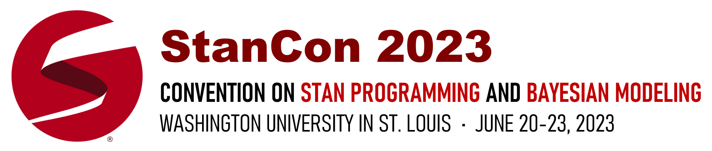

 

<a href="https://buytickets.at/standevelopmentteam/835500" title="Buy tickets for StanCon 2023">Buy tickets for StanCon 2023</a>

------
- [**Sponsors**](#sponsors)
- [**Invited speakers**](#invited-speakers)
- [**Tutorials**](#tutorials)
- [**Talks**](#talks)
- [**Call for proposals**](#call-for-proposals)
- [**Schedules**](#schedules)
- [**Registration**](#registration)
- [**Organizers**](#organizers)

------

Stan (http://mc-stan.org) is a probabilistic programming and statistical modeling language used by tens of thousands of scientists, engineers, and other researchers for statistical modeling, data analysis, and prediction. It is being applied academically and commercially across fields as diverse as ecology, pharmacometrics, physics, political science, finance and econometrics, professional sports, real estate, publishing, recommender systems, and educational testing.

If you have questions regarding registration, payments, travel, please email
[stancon2023@mc-stan.org](mailto:stancon2023@mc-stan.org).

StanCon participants are expected to abide by the [Stan code of conduct](https://discourse.mc-stan.org/t/announcing-our-new-stan-code-of-conduct/23764).

------

# [Invited speakers](#speakers)
**Bob Carpenter** (Flatiron institute)

**John Kruschke** (Indiana University)

**Mariel Finucane** (Mathematica Policy Research)

**Siddhartha Chib** (Washington University in St. Louis)

# [Tutorials](#tutorials)

**Introduction to Bayesian hierarchical modeling using Stan and brms**\
**Instructor:** Mitzi Morris (Columbia University) and Mike Lawrence

**Ordinary differential equation (ODE) models in Stan**\
**Instructor:** Daniel Lee.

**Cognitive diagnostic models in R and Stan**\
**Instructor:** W. Jake Thompson, PhD (Assistant Director of Psychometrics | ATLAS | University of Kansas). See tutorial summary [here](img/dcm-tutorial-description.pdf).

### ....

# [Talks](#talks)
**Access Stan models from your favorite language with BridgeStan**\
Edward A. Roualdes (CSU, Chico)

**Abstract**: BridgeStan provides efficient in-memory access to the methods of Stan models through Python, Julia, and R. This allows algorithm
development in these languages with the efficiency and xpressiveness of Stan models. Importantly, methods for og-density, gradient, and Hessian evaluations as well as
constraining and unconstraining transforms are exposed from an nderlying Stan model, with zero to minimal additional memory llocations.  Furthermore, these features are exposed through a anguage-agnostic C API, allowing foreign function interfaces in ther languages with minimal additional development.\

### Using Stan for Bayesian Discrete Choice Models: A Healthcare Case Study
Srinivas Kowta

**Abstract**: This paper compares a traditional logit model vs. a Bayesian model using Stan in the R eco-system as applied to a discrete choice dataset in the healthcare arena. Additionally comparison is conducted on a sub-segment where two of the choice attributes may present multi-collinearity challenges in determining the best drivers of the brand chosen.

### Bayesian pipelines with stantargets
Will Landau (Eli Lilly)

Abstract: The stantargets R package is an extension of CmdStanR, a lightweight interface to Stan, and targets, a general-purpose pipeline tool for reproducible research and high-performance computing. In stantargets, a complicated Stan workflow becomes a concise targets pipeline, and targets orchestrates the pipeline to efficiently bring the results up to date with the underlying code and data. By simplifying pipeline creation, stantargets reduces the practical burden of developing and maintaining reproducible analysis workflows for Bayesian statistics.

### Journey to efficient sampling in multivariate normal latent variable models
Edgar Merkle (University of Missouri)

Abstract: Latent variable models arising from psychometrics overlap with many families of traditional statistical models, including mixed models, generalized linear models, time series models, and path models. There are many ways to estimate these models in Stan, some of which are much slower and inefficient than others. In the talk, I will describe Stan strategies for coding the models, so that the sampling is as fast and efficient as possible. These strategies are informed by my 8 years of experience of developing blavaan, which is an R package for Bayesian latent variable modeling that relies on Stan under the hood. The talk will focus on multivariate normal models, with extensions to multivariate probit models and multilevel, multivariate models. I will conclude with discussion of some areas where I think further improvement could be made.

### Parameterization of complex models ... easy as ABC (Approximate Bayesian Computation)
Paul Johnson (Vanderbilt)

Abstract: Approximate Bayesian Computation (ABC) is a flexible approach that allows statisticians to perform Bayesian inference in cases where a likelihood function is either unknown or too complex to be represented in closed form (e.g., agent-based simulations). However, ABC is not as commonly featured in the literature compared to traditional MCMC sampling or surrogate modeling techniques. Here, we provide an overview of the ABC framework and demonstrate its utility with an applied case study analyzing economic risks of supply-chain disruptions due to flooding along the Upper Mississippi River. We show that with even one observational data point, the ABC framework can help researchers quantify uncertainties of parameters in complex models. 

### bibat: a batteries-included Bayesian analysis template
Teddy Groves (Technical University of Denmark)

Abstract: Choosing how to structure and write code that implements a Bayesian workflow can be very tricky, especially when there are multiple models, datasets and data transformations to keep track of. Bibat aims to make creating a high-quality, scaleable Python-and-Stan based Bayesian statistical analysis project less of a hassle by providing easy access to automation, a file-based and declarative workflow and a project structure with well-designed abstractions and modules. Bibat is "batteries-included" in the sense that it works out of the box: just run the command `bibat` then fill in a quick form and bibat will create a project implementing a complete example analysis that you can run with the command `make analysis`. My talk will explain bibat's main features and hopefully prompt you to give me feedback about its design. You can find bibat's source code on github here https://github.com/teddygroves/bibat/, or read the documentation here https://bibat.readthedocs.io/en/latest/
 
### Bayesian PBPK Modeling using R/Stan/Torsten and Julia/SciML/Turing.jl
William R Gillespie (Metrum Research Group)

Abstract: Physiologically-based pharmacokinetic (PBPK) models are mechanistic models that are built based on an investigator's prior knowledge of the in vivo system of interest. Bayesian inference incorporates an investigator's prior knowledge of parameters while using the data to update this knowledge. As such, Bayesian tools are well-suited to infer PBPK model parameters using the strong prior knowledge available while quantifying the uncertainty on these parameters. This brief tutorial demonstrates a full population Bayesian PBPK analysis framework using R/Stan/Torsten and Julia/SciML/Turing.jl.

### MCMC-Monitor: Browser-based Monitoring of Stan MCMC Samplers, In Progress
Jeff Soules (Flatiron Institute)

Abstract: We have developed MCMC-Monitor, a browser-based visualization tool for live-monitoring of MCMC samplers. It displays interactive plots of standard and user-specified variables for MCMC runs, both during sampling and after run completion. Plots include timeseries line charts showing the evolution of variables on a per-chain or cumulative basis; histograms; 2- and 3-D scatterplots of user-selected variable combinations; and autocorrelation function plots, as well as tabular data, including effective sample size estimates. Variables include user-requested subsets of model parameters, as well as Stan-computed descriptive variables like per-draw log probability, acceptance rate, stepsize, and more. By exposing these data in graphical format in real-time, MCMC-Monitor provides insight into the convergence of live runs, allowing users to make adjustments before expending time and compute resources. One distinctive feature of MCMC-Monitor is that it allows monitoring runs either on the local machine or on a remote computer.

### ...

# [Call for proposals](#call)

We invite participants to submit proposals for contributed talks, thematic sessions, posters, and tutorials.

We are interested in a broad range of topics relevant to the Stan community, including:

* Applications of Bayesian statistics using Stan in all domains
* Software development to support or complement the Stan ecosystem
* Methods for Bayesian modeling, relevant to a broad range of users
* Theoretical insights on common Bayesian methods and models
* Visualization techniques
* Tools for teaching Bayesian modeling

Keep in mind that StanCon brings together a diverse audience. Material which focuses on an application should introduce the problem to non-field experts; theoretical insights should be linked to problems modelers are working on, etc.

_We review proposals on a rolling basis and can often make decisions before the submission deadline. Accepted talks will progressively get added to the schedule._

## [Call for contributed talks](#call-talks)

Talks are 15 minutes long, with an additional 5 minutes dedicated to questions.

To submit a proposal for a contributed talk, submit a [form](https://forms.gle/4fbNbd4p32MFPR219) by **April 30th**.

## [Call for thematic sessions](#call-sessions)

Thematic sessions are an opportunity to dive deeper into a topic and comprise three talks (15 + 5 minutes each), with an additional 10 minutes which can be used for a panel discussion. Thematic sessions may be run in parallel.

To submit a proposal for a contributed talk, submit a [form](https://forms.gle/HcfZPS3jMb8HGqsY8) by **April 30th**.

## [Call for posters](#call-posters)

We invite participants to submit abstracts for posters. These abstracts will be reviewed by the StanCon scientific committee. Accepted posters will be displayed in a dedicated room during the conference. In addition, an online version of the poster will be available. We encourage authors to share code with which the results and figures in the poster can be reproduced.

Posters should be 24in x 48in.

If the poster summarizes work presented in a longer document (e.g. a paper, a doc), please reference this document.

An example poster from StanCon 2018 can be found [here](https://www.metrumrg.com/wp-content/uploads/2018/09/stan_pde_poster.pdf).

To submit an abstract, submit a [form](https://forms.gle/rm2a6KFfhXJ5CyL67). We accept poster submission on a rolling basis.

## [Call for tutorials](#call-tutorials)

Tutorials are an opportunity to do an in-depth exploration of a particular topic and may focus on a class of models, certain features in the Stan language, or a new package in the broader Stan ecosystem. Tutorials typically include hands-on exercises, which participants can perform on their own computers.

Tutorials may comprise a single session of 2 or 3 hours (half-a-day) or two sessions of 2 or 3 hours each (full day).

To submit a proposal for a tutorial, submit a [form](https://forms.gle/tgGmaSrQM7yTmHMA7) by **April 30th**.

# [Sponsors](#sponsors)
We would like to thank our sponsors who both support conference costs, scholarships, and Stan as a whole. If you’re interested in sponsoring StanCon, please email [stancon2023@mc-stan.org](mailto:stancon2023@mc-stan.org).

<!-- 
 -->
<!--  -->
<!--  -->
<!--  -->

<!--  -->
<!-- 
 -->

<!--  -->
<!-- 
 -->

<!--  -->
<!-- 
 -->

<!--  -->
<!-- 
 -->

<!--  -->
<!-- 
 -->

<!-- 
 -->

# [Schedules](#schedules)
<ul>
<li>Tutorials: June 20-21, 2023</li>

<li>Conference: June 22-23, 2023</li>

<li> Conference Dinner: June 22, 2023</li>

</ul>
Details coming soon.

# [Registration](#registration)

<a href="https://buytickets.at/standevelopmentteam/835500" title="Buy tickets for StanCon 2023">Buy tickets for StanCon 2023</a>

Early bird window extended till April 30, 2023! Registration fees cover lunch, coffee & refreshment breaks, icebreaker reception (June 21 PM), and conference dinner.

_Information about scholarships will be posted soon._

### Conference only

$199(student) | $299(academic) | $449(industry)

### Tutorial & workshop + Conference

$299(student) | $449(academic) | $599(industry)

# [Organizers](#organizers)
- Charles Margossian (Flatiron Institute)
- Debashis Mondal (Washington University in St. Louis)
- Eric Ward (NOAA & University of Washington)
- Vianey Leos Barajas (University of Toronto) 
- Yi Zhang (Sage Therapeutics, Inc)
