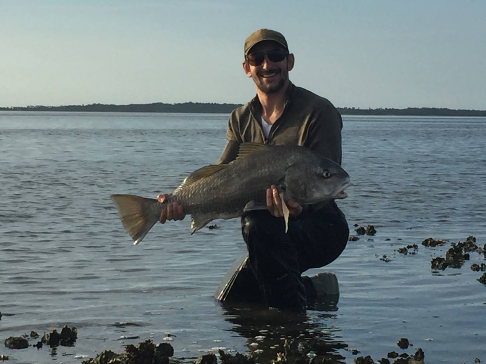

<body>

<h3 style="float:center;">
</body>
## Clayton J. Visger
(Principal Investigator)
* [ResearchGate](https://www.researchgate.net/profile/Clayton_Visger)
* [Twitter](https://twitter.com/hoityploidy)
* [GitHub](https://github.com/cvisger)
* clayton.visger at csus dot edu

<body1>

<h3 style="float:left;">
</body1>
## Bandit
(Field dog)  
 
 
 

---
## Collaborators
