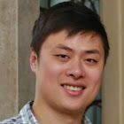

Dennis joined The University of Sheffield in September 2016 as a Lecturer in Genomic Medicine

- [LinkedIn](https://www.linkedin.com/in/dennis-wang-77378828/)
- [github](https://github.com/TransAnalytics)
- [Google Scholar](https://scholar.google.co.uk/citations?user=1dgKTJoAAAAJ&hl=en)

## Positions Held
2016 – Present: Lecturer in Bioinformatics and Genomic Medicine, University of Sheffield

2014 – 2016: Senior Scientist, AstraZeneca

2012 – 2014: Scientific Associate, Princess Margaret Cancer Centre, Toronto, Canada

 
## Biography
Dennis obtained his MPhil and PhD in Computational Biology at the University of Cambridge. This was followed by staff scientist positions at the Ontario Cancer Institute and AstraZeneca.  He is currently a lecturer in genomics and bioinformatics at the NIHR Sheffield Biomedical Research Centre.

Dennis focuses on translating complex genomic patterns into actionable information for the development of personalized medicines. This involves integrating genomics information to build algorithms that predict clinical outcome and identifying genetic biomarkers through feature selection. Dennis also seeks to develop better ways to stratify patients based on clinical phenotypes and treatment response. As the co-Lead for the MSc in Genomic Medicine course and co-Director of the newly established Translational Genomics Centre in Sheffield, he addresses these aims with both teaching and research. 

Having worked at academia and industry, he enjoys working collaboratively to promote data driven approaches for personalizing medical care. 

