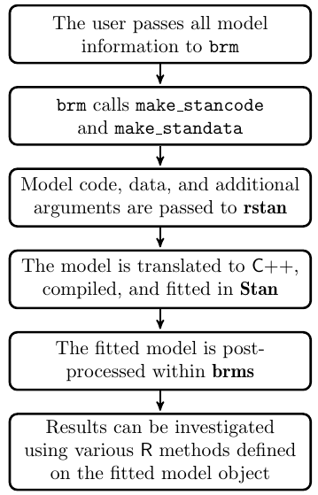

<style type="text/css">
slides > slide:not(.nobackground):after {
  content: '';
}
</style>

```{r setup, include=FALSE}
options(width = 90)
library(knitr)
library(rgl)
knit_hooks$set(rgl = hook_plot_custom)
knit_hooks$set(small.mar = function(before, options, envir) {
    if (before) par(mar = c(4, 4, .1, .1), las = 1)  # smaller margin on top and right
})
hook_output <- knit_hooks$get("output")
knit_hooks$set(output = function(x, options) {
  lines <- options$output.lines
  if (is.null(lines)) {
    return(hook_output(x, options))  # pass to default hook
  }
  x <- unlist(strsplit(x, "\n"))
  more <- "..."
  if (length(lines)==1) {        # first n lines
    if (length(x) > lines) {
      # truncate the output, but add ....
      x <- c(head(x, lines), more)
    }
  } else {
    x <- c(more, x[lines], more)
  }
  # paste these lines together
  x <- paste(c(x, ""), collapse = "\n")
  hook_output(x, options)
})
options(mc.cores = parallel::detectCores())
```

## The **brms** Workflow (Figure 1 in Bürkner 2016)



## The Arguments to `brm`

```{r, message = FALSE}
library(brms)
args(brm)
```

## The `formula` Argument to `brm`

* Everything to the right of the `~` is the same as in many other R functions
* In many cases, the thing to the left of the `~` is simply the outcome variable
* However, `brm` introduces a new possibility for this syntax like `y | fun(variable)`,
  where `fun` could be
    * `cens()` and `trunc()` to specify known censoring or truncation bounds
    * `weights()` and `disp()`, which should not be used with MCMC
    * `se()` to specify "known" standard errors in meta-analyses
    * `trials()`, which is used in binomial models only
    * `cat()` to specify the possible categories for ordinal models

## The `family` Argument to `brm`

The `family` argument can be any of the following functions, which also have a 
link argument that can be a variety of things depending on the family
```{r, eval = FALSE}
gaussian; student; binomial; bernoulli; poisson; negbinomial; geometric; Gamma; 
skew_normal; lognormal; shifted_lognormal; exgaussian; wiener; inverse.gaussian; 
exponential; weibull; frechet; Beta; dirichlet; von_mises; asym_laplace; 
gen_extreme_value; categorical; multinomial; cumulative; cratio; sratio; acat; 
hurdle_poisson; hurdle_negbinomial; hurdle_gamma; hurdle_lognormal; 
zero_inflated_binomial; zero_inflated_beta; zero_inflated_negbinomial; 
zero_inflated_poisson; zero_one_inflated_beta
```

## The `prior` Argument to `brm` {.smaller}

```{r}
args(set_prior)
```

* `prior` is a character string (in the Stan language) such as `"normal(0,5)"`
* `class` indicates what parameters the call to `set_prior` pertains to
* `coef` is the name of the parameter in question
* `group` is the name of the grouping factor (if applicable)
* `resp` is the name of the response variable in multivariate models
* `dpar` is the name of the distribution parameter (if applicable)
* `nlpar` is the name of the non-linear parameter (if applicable)
* `lb` is the lower bound of the parameter (default $-\infty$)
* `ub` is the upper bound of the parameter (default $\infty$)
* `check` whether priors should be checked for validity

## The `get_prior` Function

* Input the `formula`, `data`, and `family` and get back the possible prior choices (and defaults)

```{r}
get_prior(time | cens(censored) ~ age * sex + disease,
          data = kidney, family = lognormal())
```

## The `class` Argument to `set_prior`

* Refers to a type of parameter in the model 
* Defaults to `"b"` which refers to (population-level) regression coefficients
* Other possible values are `"Intercept"`, `"sd"`, `"cor"`, `"sigma"` and others we may talk about
  later
```{r}
my_prior <- prior(cauchy(0, 1), class = "b")
```
* If you call `prior` rather than `set_prior`, the first argument can be an R expression rather
  than a character string

## Chapter 12 of _Rethinking_ and Kurz's Supplement

* McElreath's _Rethinking Statistics_ textbook talks a lot about hierarchical models but uses his
  **rethinking** package to specify the models
* If you have not done so already, do
```{r, eval = FALSE}
remotes::install_github("rmcelreath/rethinking", ref = "Experimental")
```
to access the datasets

* Solomon Kurz has written an online [book](https://bookdown.org/connect/#/apps/1850/access) that 
specifies all the models in **brms** and plots everything using **ggplot2** or similar

## Reedfrog Tanks

```{r, message = FALSE}
data(reedfrogs, package = "rethinking")
library(brms)
d <- reedfrogs
d$tank <- factor(1:nrow(d))
```
```{r, b12.1, cache = TRUE, results = "hide", message = FALSE, warning = FALSE}
b12.1 <- brm(surv | trials(density) ~ 0 + factor(tank), # independent priors
             data = d, family = binomial, prior(normal(0, 5), class = b))
```
```{r, output.lines = -(1:8)}
b12.1
```

## Multilevel Reedfrog Tanks

```{r, b12.2, cache = TRUE, results = "hide", message = FALSE, warning = FALSE}
b12.2 <- brm(surv | trials(density) ~ 1 + (1 | tank), data = d, family = binomial,
             prior = c(prior(normal(0,1), class = Intercept), prior(cauchy(0,1), class = sd)))
```
```{r, output.lines = -(1:7)}
b12.2
```

## Shrinkage

```{r, echo = FALSE, out.width="750px"}
knitr::include_graphics("https://bookdown.org/content/1850/_main_files/figure-html/unnamed-chunk-659-1.png")
```

## Posterior Predicting a New Tank

```{r}
nd <- data.frame(density = 20, tank = "49") # there were only 48 tanks originally
PPD <- posterior_predict(b12.2, newdata = nd, allow_new_levels = TRUE)
prop.table(table(PPD))
```

- Hierarchical models predict the existing data worse in order to better model
  the data-generating process and thereby predict future data better

## Using the **brms** Package to Generate Stan Code

```{r}
code <- make_stancode(surv | trials(density) ~ 1 + (1 | tank), data = d, family = binomial,
                      prior = c(prior(normal(0,1), class = Intercept), 
                                prior(cauchy(0,1), class = sd)))
dat <- make_standata(surv | trials(density) ~ 1 + (1 | tank), data = d, family = binomial,
                     prior = c(prior(normal(0,1), class = Intercept), 
                               prior(cauchy(0,1), class = sd)))
```

## Generated Data List {.smaller}

```{r, echo = FALSE}
str(dat)
```

## Generated Stan Code {.smaller}

<div class="columns-2">
```{r, echo = FALSE, comment = ""}
code[1] <- sub("// generated with brms 2.8.9\n", "", code[1], fixed = TRUE)
code[1] <- gsub("{\n}", "{}", code[1], fixed = TRUE)
code
```
</div>

## Admissions Example

```{r}
data("UCBadmit", package = "rethinking")
d <- UCBadmit
d$Male <- d$applicant.gender == "Male"
d$dept_id = rep(1:6, each = 2)
```
```{r, b13.3, cache = TRUE, results = "hide", message = FALSE, warning = FALSE}
b13.3 <- brm(admit | trials(applications) ~ 1 + Male + (1 + Male | dept_id), 
             data = d, family = binomial,
             prior = c(prior(normal(0, 2), class = Intercept),
                       prior(normal(0, 1), class = b),
                       prior(cauchy(0, 2), class = sd)))
coef(b13.3)$dept_id
```

## Results by Department

```{r, echo = FALSE}
coef(b13.3)$dept_id
```
