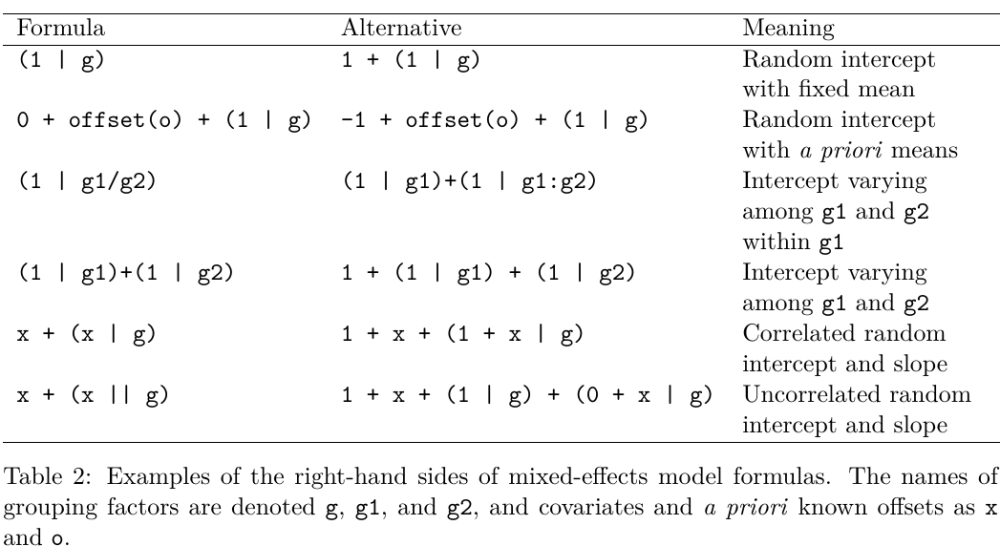

<style type="text/css">
slides > slide:not(.nobackground):after {
  content: '';
}
</style>

```{r setup, include=FALSE}
options(width = 90)
library(knitr)
library(rgl)
knit_hooks$set(rgl = hook_plot_custom)
knit_hooks$set(small.mar = function(before, options, envir) {
    if (before) par(mar = c(4, 4, .1, .1), las = 1)  # smaller margin on top and right
})
hook_output <- knit_hooks$get("output")
knit_hooks$set(output = function(x, options) {
  lines <- options$output.lines
  if (is.null(lines)) {
    return(hook_output(x, options))  # pass to default hook
  }
  x <- unlist(strsplit(x, "\n"))
  more <- "..."
  if (length(lines)==1) {        # first n lines
    if (length(x) > lines) {
      # truncate the output, but add ....
      x <- c(head(x, lines), more)
    }
  } else {
    x <- c(more, x[lines], more)
  }
  # paste these lines together
  x <- paste(c(x, ""), collapse = "\n")
  hook_output(x, options)
})
library(rstanarm)
```

## Goals for the Second Session

* Differences between Frequentist and Bayesian estimators of hierarchical models
* Estimate a hierarchical model using **rstanarm**

## What Are Hierarchical Models?

* In Bayesian terms, a hierarchical model is nothing more than a model where the prior distribution
  of some parameter depends on another parameter
* In other words, it is just another application of the Multiplication Rule, followed by a marginalization
$$f\left(\boldsymbol{\theta}\right) = \int f\left(\boldsymbol{\theta} \mid \boldsymbol{\phi}\right)
  f\left(\boldsymbol{\phi}\right) d\phi_1 \dots d\phi_K$$
* But most of the discussion of "hierarchical models" refers to the very narrow circumstances
  in which they can be estimated via frequentist methods

## Cluster Sampling vs. Stratified Sampling

* For cluster random sampling, you

  * Sample $J$ large units (such as schools) from their population
  * Sample $N_j$ small units (such as students) from the $j$-th large unit

* If you replicate such a study, you get different realizations of the large units
* For stratified random sampling, you

  * Divide the population of large units into $J$ mutually exclusive and exhaustive groups (like states)
  * Sample $N_j$ small units (such as voters) from the $j$-th large unit

* If you replicate such a study, you would use the SAME large units and only
  get different realizations of the small units
  
>- From a frequentist perspective, a hierarchical model is appropriate for 
  cluster designs, inappropriate for stratified designs, and hard to justify otherwise

## Why Bayesians Should Use Hierarchical Models

* Suppose you estimated a Bayesian model on people in France
* Next, you are going to collect data on people who live in Germany
* Intuitively, the France posterior should influence the Germany prior
* But it is unlikely that the data-generating processes in Germany is exactly the
  same as in France
* Hierarchical models apply when you have data from France, Germany, and other
  countries at the same time
* Posterior distribution in any one country is not independent of other countries
  but it is not the same in all countries
* McElreath argues hierarchical models should be the default and "flat" models
  should be the rare exception only when justified by the data
* With more data, there is always more heterogeneity in the data-generating processes
  that a generative model should be allowing for

## Models with Group-Specific Intercepts

- Let $\alpha$ be the common intercept and $\boldsymbol{\beta}$ be the common coefficients while
  $a_j$ is the deviation from the common intercept in the $j$-th group. Write the model as:
$$y_{ij} = \overbrace{\underbrace{\alpha + \sum_{k = 1}^K \beta_k x_{ik}}_{\mbox{Frequentist }
\boldsymbol{\mu} \mid \mathbf{x}}+a_j}^{\mbox{Bayesian } \boldsymbol{\mu} \mid \mathbf{x},j} +\boldsymbol{\epsilon} = \alpha + \sum_{k = 1}^K \beta_k x_{ik}+\underbrace{a_j\overbrace{\boldsymbol{\epsilon}}^{\mbox{Bayesian error}}}_{\mbox{Frequentist error}}$$
- The same holds in GLMs where $\eta_{ij} = \alpha + \sum_{k = 1}^K \beta_k x_{ik} + a_j$ 
  or $\eta_{ij} = \alpha + \sum_{k = 1}^K \beta_k x_{ik}$ depending on whether you are
  Bayesian or Frequentist
  
## Models with Group-Specific Slopes and Intercepts
  
- Let $\alpha$ be the common intercept and $\boldsymbol{\beta}$ be the common coefficients while
  $a_j$ is the deviation from the common intercept in the $j$-th group and $\mathbf{b}_j$ is
  the deviation from the common coefficients. Write the model as:
$$y_{ij} = \overbrace{\underbrace{\alpha + \sum_{k = 1}^K \beta_k x_{ik}}_{\mbox{Frequentist }
\boldsymbol{\mu} \mid \mathbf{x}} + a_j + \sum_{k = 1}^K b_{jk} x_{ik}}^{\mbox{Bayesian } \boldsymbol{\mu} \mid \mathbf{x},j} +\boldsymbol{\epsilon} = \\ \alpha + \sum_{k = 1}^K \beta_k x_{ik}+\underbrace{a_j + \sum_{k = 1}^K b_{jk} x_{ik}\overbrace{\boldsymbol{\epsilon}}^{\mbox{Bayesian error}}}_{\mbox{Frequentist error}}$$
- And similarly for GLMs

## Frequentist Estimation of Multilevel Models

- Frequentists assume that $a_j$ and $b_j$ deviate from the common parameters according
  to a (multivariate) normal distribution, whose (co)variances are common parameters
  to be estimated
- To Frequentists, $a_j$ and $b_j$ are not parameters because parameters must remained
  fixed in repeated sampling of observations from some population
- Since $a_j$ and $b_j$ are not parameters, they can't be "estimated" only "predicted"
- Since $a_j$ and $b_j$ aren't estimated, they must be integrated out of
  the likelihood function, leaving an integrated likelihood function of the common
  parameters
- After obtaining maximum likelihood estimates of the common parameters, each
  $a_j$ and $b_j$ can be predicted from the residuals via a regression
- Estimated standard errors produced by frequentist software are too small
- There are no standard errors etc. for the $a_j$ and $b_j$
- Maximum likelihood estimation often results in a corner solution

## Table 2 from the **lme4** [Vignette](https://www.jstatsoft.org/article/view/v067i01/0) (see also the [FAQ](https://bbolker.github.io/mixedmodels-misc/glmmFAQ.html#model-specification))



## Hierarchical Models in **rstanarm** (from this [paper](http://www.tqmp.org/RegularArticles/vol14-2/p099/p099.pdf))

```{r, message = FALSE}
dat <- read.csv("https://osf.io/5cg32/download"); colnames(dat)
```

```{r, psych, cache = TRUE, results = "hide", warning = FALSE}
post <-  stan_glmer(valence ~ arousal + (1 + arousal | PID), data = dat,
                    prior = normal(0, 1, autoscale = FALSE), 
                    prior_intercept = normal(50, 10, autoscale = FALSE))
post
```
<div class="columns-2">
```{r, output.lines = (6:20), warning = FALSE, echo = FALSE}
post
```
</div>

## Accessor Functions (based on the **lme4** package)

```{r}
fixef(post)
cbind(b = head(ranef(post)$PID), total = head(coef(post)$PID))
dim(as.matrix(post)) # 4000 x 46
```

## Posterior Predictive Checks

```{r, fig.width=10, fig.height=5}
pp_check(post, plotfun = "ribbon_grouped", x = dat$arousal, group = dat$PID)
```

## Conclusions

* Estimating a hierarchical model with **rstanarm** is no harder than estimating
  a hierarchical model with **lme4**

    * Avoids a lot of convergence errors / warnings in more complicated hierarchical models
    * Gets the uncertainty right
    * Can make principled inferences about group-specifc parameters instead of integrating them out

    